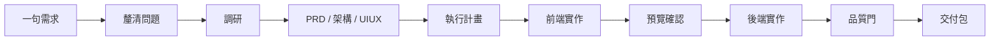
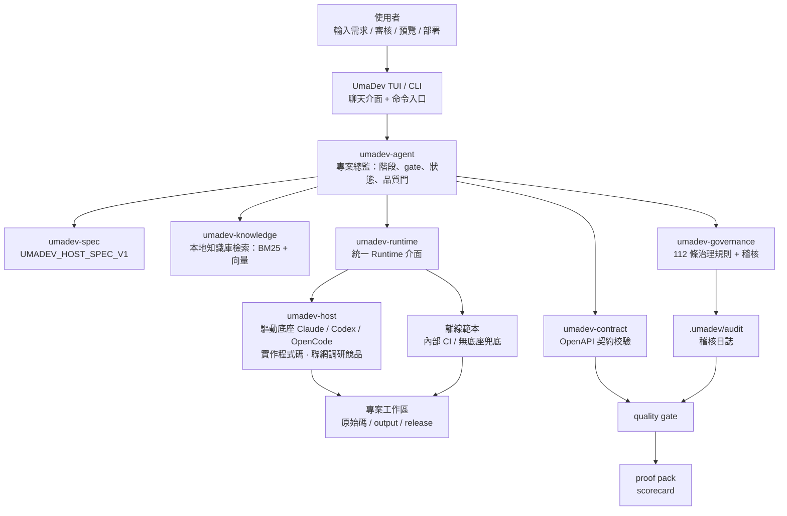
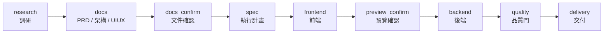
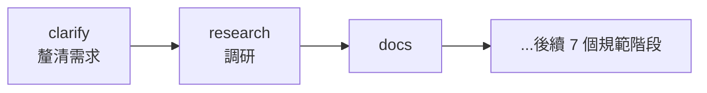
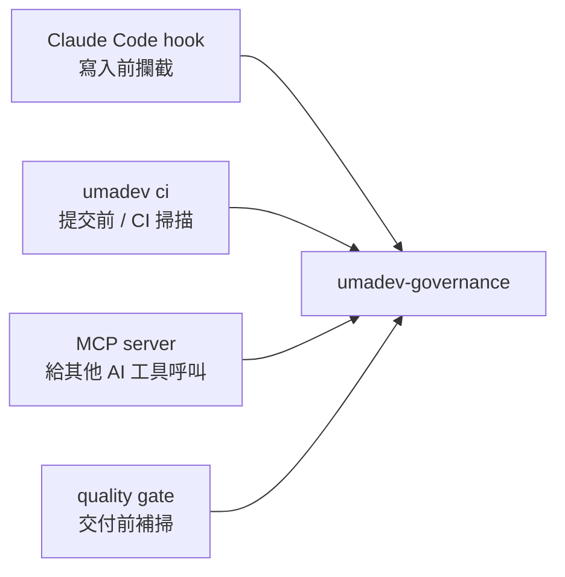
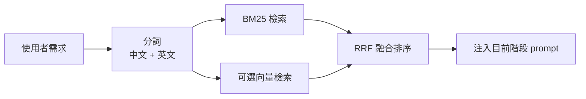

# UmaDev

<div align="center">


### 把 AI 編碼工具變成真正的專案總監 Agent

**從一句需求，到 PRD、架構、UI/UX、程式碼、品質門、交付包。**

[](LICENSE)
[](https://www.rust-lang.org/)
[](spec/UMADEV_HOST_SPEC_V1.md)
[](CHANGELOG.md)

[简体中文](README.md) | 繁體中文 | [English](README_EN.md)

</div>

---

## 目錄

- [簡介](#簡介) · [專案來源](#專案來源) · [它解決什麼問題](#它解決什麼問題)
- [快速體驗](#快速體驗) · [一個完整例子](#一個完整例子) · [UmaDev 如何工作](#umadev-如何工作)
- [執行模式](#執行模式) · [流水線設計](#流水線設計) · [品質門是什麼](#品質門是什麼)
- [治理規則是什麼](#治理規則是什麼) · [知識庫是什麼](#知識庫是什麼) · [交付產物長什麼樣](#交付產物長什麼樣)
- [**指令大全**](#指令大全) · [設定](#設定) · [Rust 架構](#rust-架構) · [開發](#開發)

## 簡介

UmaDev 是一個本地執行的 AI 編碼專案總監 Agent。它不取代 Claude Code、Codex、OpenCode，也不販售模型 API。它做的是更上層的事：

1. **把你的需求拆成完整交付流程**：先釐清，再調研，再寫 PRD、架構、UI/UX，再實作前後端，最後跑品質門和交付。
2. **驅動你已經登入的 AI 編碼工具**：Claude Code / Codex / OpenCode 負責真正寫程式碼，UmaDev 負責讓它們照流程做事。
3. **把交付過程變成可檢查、可恢復、可稽核**：每個階段有產物，每次重要操作有證據，最後有 quality gate、compliance mapping 和 proof pack。

如果一般 AI 編碼工具像一位能力很強的工程師，那麼 UmaDev 的角色更像：

> 產品經理 + 架構師 + UI/UX 審稿人 + 技術負責人 + QA + 交付經理。

你只要輸入一句需求，UmaDev 負責把「AI 寫程式碼」變成一個完整軟體交付流程。

## 專案來源

UmaDev 脫胎於原專案 [shangyankeji/super-dev](https://github.com/shangyankeji/super-dev)。

早期的 `super-dev` 更像一個 **AI 編碼治理工具**：主要關注「AI 生成程式碼時不能寫什麼」，例如不要用 emoji 當圖示、不要硬編碼顏色、不要寫不安全程式碼。

現在的 UmaDev 已經升級成完整 Agent：

- **從治理工具升級為專案總監 Agent**：不只檢查程式碼，而是負責從需求到交付的完整流程。
- **從零散腳本升級為規範驅動系統**：核心是 [UMADEV_HOST_SPEC_V1](spec/UMADEV_HOST_SPEC_V1.md)，所有實作都圍繞規範。
- **使用 Rust 重寫**：單一二進位、跨平台、啟動快、相依少，適合本地長期執行。
- **從「攔截問題」升級為「帶著底座完成專案」**：Claude Code / Codex / OpenCode 是大腦和手，UmaDev 是總監和流程引擎。

一句話概括這次演進：

> `super-dev` 關注「AI 不要寫爛程式碼」；`UmaDev` 關注「AI 如何交付一個完整、可上線、可稽核的商業專案」。

## 它解決什麼問題

很多人第一次使用 AI 編碼工具時，都會遇到類似問題：

- AI 一開始就寫程式碼，沒有 PRD、沒有架構、沒有驗收標準。
- 前端做完了，後端 API 路徑對不上。
- UI 看起來像範本，顏色和字體很隨意。
- AI 寫了佔位程式碼、假資料、TODO，卻說「完成了」。
- 修改一次需求後，上下文開始混亂，前面約定被忘掉。
- 程式碼能生成，但沒有品質報告、沒有證據鏈，不知道能不能交付。
- 團隊有自己的規範和知識庫，但每次都要手動複製給 AI。

UmaDev 的目標就是把這些問題系統化解決。

它會強制 AI 走一條更像真實團隊的流程：



## 快速體驗

### 1. 安裝

推薦用 npm 安裝預編譯二進位：

```bash
npm install -g umadev
```

npm 只是分發外殼。真正執行的是 Rust 編譯出的 `umadev` 二進位。

支援平台：

- macOS Apple Silicon
- macOS Intel
- Linux x86_64
- Linux ARM64
- Windows x86_64

也可以從原始碼建置：

```bash
git clone https://github.com/umacloud/umadev.git
cd umadev
cargo build --release
./target/release/umadev --version
```

### 2. 準備一個 AI 編碼底座

UmaDev 推薦驅動你已經登入的 CLI：

```bash
# 三選一即可
npm install -g @anthropic-ai/claude-code
npm install -g @openai/codex
npm install -g opencode-ai
```

然後依照這些工具自己的方式登入。

UmaDev 不保存你的 Claude / Codex / OpenCode 登入資訊。它只是把任務作為非互動命令發給它們。

### 3. 初始化專案

```bash
cd your-project
umadev init
```

這一步會寫入一些專案設定：

```text
umadev.yaml              # 宣告這是 UmaDev 管理的專案
.umadevrc               # 專案級設定
.umadev/rules.toml      # 治理規則設定
CLAUDE.md               # 給 Claude Code 看的專案說明
.gitignore              # 忽略 UmaDev 執行產物
knowledge/              # 專案內知識庫和設計系統種子
```

### 4. 啟動

```bash
umadev
```

第一次開啟會讓你選擇：

1. 介面語言。
2. 使用哪個底座：Claude Code、Codex 或 OpenCode（你已經登入的那個）。

之後直接輸入需求：

```text
做一個面向獨立開發者的 SaaS 訂閱管理後台，包含登入、訂閱方案、帳單記錄和管理員儀表板。
```

UmaDev 會開始組織完整流程。

### 5. 預覽和交付

前端階段完成後：

```text
/preview
```

交付階段完成後：

```text
/deploy
```

最終交付證據會在：

```text
output/
release/
.umadev/audit/
```

其中最重要的是：

```text
release/proof-pack-<project>-<time>.zip
release/scorecard-<project>-<time>.html
```

這兩個檔案就是給團隊、客戶或審核者看的交付證明。

## 一個完整例子

假設你在一個空專案裡執行：

```bash
umadev init
umadev
```

然後輸入：

```text
做一個課程預約小程式，使用者可以查看課程、選擇時間、預約、取消預約，管理員可以管理課程和預約記錄。
```

UmaDev 會做這些事：

1. **理清需求**：補全目標平台、是否需要支付、管理後台複雜度等合理預設假設（自動模式下自動推進、不打斷你；手動模式可逐條確認）。
2. **聯網調研**：當底座具備聯網能力時，搜尋同類小程式 / 預約系統的競品功能、定價、設計趨勢和真實使用者評價；同時檢索內建知識庫裡的預約系統、後台 CRUD、權限、表單校驗等規範。兩者合併產出調研報告 `output/<slug>-research.md`。
3. 生成 PRD，明確使用者角色、功能範圍、EARS 可測驗收標準。
4. 生成架構文件，定義資料模型、API、鑑權、部署方式。
5. 生成 UI/UX 文件，定義設計方向、顏色 token、字體、元件狀態、圖示庫。
6. 拆成執行計畫和任務（每個任務回鏈到需求 FR 編號）。
7. 驅動底座實作前端。
8. 暫停讓你預覽。
9. 驅動底座實作後端和整合。
10. 跑品質門：文件、契約、建置、設計、安全、交付檔案全部檢查。
11. 生成交付包和成績單。

整個過程不是「AI 聊完就算完成」，而是會留下真實檔案。

## UmaDev 如何工作

整體架構可以理解成四層：



更簡單地說：

- **TUI/CLI**：你和 UmaDev 交流的地方。
- **Agent Runner**：決定現在該做哪個階段、什麼時候暫停、什麼時候繼續。
- **Research（第 1 階段）**：先讓底座聯網調研同類產品 / 競品 / 趨勢 / 真實評價，疊加本地知識庫，產出 `research.md`——不是上來就寫程式碼。
- **Runtime / 底座**：把任務交給你登入的底座（Claude Code / Codex / OpenCode）——底座用它自己的登入和模型，既負責寫真實程式碼，也負責聯網調研競品；UmaDev 不注入、不覆寫任何模型或 key。
- **Governance/Quality**：檢查 AI 寫出來的東西是否符合規範。
- **Knowledge**：把工程標準、設計系統、領域知識（本地 BM25 + 向量檢索）注入給底座。
- **Evidence**：把過程記錄下來，最後打包交付。

## 執行模式

### 模式 A：驅動本機 AI 編碼 CLI

這是推薦模式。

| Backend ID | 實際程式 | UmaDev 如何呼叫 | 適合誰 |
|---|---|---|---|
| `claude-code` | `claude` | `claude --print --output-format text` | 已經在用 Claude Code 的使用者 |
| `codex` | `codex` | `codex exec --sandbox workspace-write` | 已經在用 Codex CLI 的使用者 |
| `opencode` | `opencode` | `opencode run` | 已經在用 OpenCode 的使用者 |

### 底座自帶模型 —— UmaDev 不接外部 API

UmaDev 不自帶模型，也不接第三方 API —— **底座用它自己的模型**（你訂閱登入的，或你給底座自己配的第三方 / 本地模型）。選底座時 UmaDev 會讀出並顯示它當前用的模型與思考強度（`/status` 也能看），但**絕不覆寫**：執行時預設不傳 `--model`，底座用它自己的；想換就改底座自己的設定，或用 `/model <id>` 暫時覆寫這一會話。

UmaDev 讀取的來源：claude 的 `~/.claude/settings.json`（`model` / `effortLevel`）、codex 的 `~/.codex/config.toml`（`model` / `model_reasoning_effort`）、opencode 的 `opencode.json`（`model`，思考強度內建在模型變體裡）。

### 模式 B：離線範本（內部兜底）

```text
/offline
```

離線模式不呼叫任何模型，也不存取網路。它適合快速看檔案結構、CI smoke test 和流程示範。

## 流水線設計

規範主鏈是 9 個階段：



目前產品實作還在主鏈前增加了一個 `clarify` 微階段：



### 每個階段會產出什麼

| 階段 | 可以理解成 | 主要檔案 |
|---|---|---|
| `clarify` | 先把需求問清楚 | `output/<slug>-clarify.md`、`output/<slug>-clarify-answers.md` |
| `research` | 聯網調研競品、領域、風險、設計趨勢 | `output/<slug>-research.md` |
| `docs` | 寫三份核心文件 | `output/<slug>-prd.md`、`output/<slug>-architecture.md`、`output/<slug>-uiux.md` |
| `docs_confirm` | 讓你確認文件方向 | `.umadev/workflow-state.json` |
| `spec` | 拆任務和執行計畫 | `output/<slug>-execution-plan.md`、`.umadev/changes/<id>/tasks.md` |
| `frontend` | 前端實作和預覽說明 | `output/<slug>-frontend-notes.md` |
| `preview_confirm` | 讓你看前端效果 | TUI gate 狀態 |
| `backend` | 後端實作和整合說明 | `output/<slug>-backend-notes.md` |
| `quality` | 獨立品質檢查 | `output/<slug>-quality-gate.json`、`output/<slug>-quality-gate.md` |
| `delivery` | 最終交付 | `output/<slug>-delivery-notes.md`、`release/proof-pack-*.zip`、`release/scorecard-*.html` |

## 品質門是什麼

品質門可以理解成 UmaDev 的「交付前驗收」。

它會檢查：

- PRD 是否有目標、範圍、驗收標準。
- 架構文件是否有 API、資料模型、錯誤處理、鑑權。
- UI/UX 文件是否有設計 token、字體、圖示庫、元件狀態、暗黑模式。
- 前端呼叫的 API 和後端契約是否一致。
- 是否存在 emoji 圖示、硬編碼顏色、AI 範本痕跡。
- 是否有建置、測試、lint、typecheck 結果。
- 是否生成 Dockerfile、CI、migration、`.env.example`。
- 是否洩露 API key、密碼、連線字串。
- 是否有稽核日誌和合規映射。

輸出檔案：

```text
output/<slug>-quality-gate.json
output/<slug>-quality-gate.md
```

預設通過線是 90 分：

```toml
[quality]
threshold = 90
skip_checks = []
```

## 治理規則是什麼

UmaDev 最早來自治理工具，這部分仍然是核心能力。

規範層有 25 條 clause，實作層目前有 112 條規則，覆蓋 UI 品質、安全、前端架構、後端工程和多語言危險模式。

治理入口：



專案可以透過 `.umadev/rules.toml` 調整：

```toml
[disabled]
clauses = []

[exclusions]
paths = ["src/legacy/**", "**/*.test.ts"]

[extra]
blocked_domains = ["internal-bad-proxy.corp"]
```

## 知識庫是什麼

UmaDev 內建了 416 份 markdown 知識檔案，不只是普通文件，而是給 AI 看的工程標準庫。

它覆蓋產品、PRD、架構、前端、後端、資料庫、安全、測試、CI/CD、運維、行動端、桌面、小程式、鴻蒙、跨平台、行業知識、UI/UX、設計系統和專家方法論。

檢索方式：



你也可以加入自己的團隊知識：

```bash
umadev knowledge-manage add ./team-docs --name team-docs
umadev knowledge-manage search "支付 webhook 冪等"
```

## 交付產物長什麼樣

一次完整執行後，目錄大致是：

```text
your-project/
  output/
    app-clarify.md
    app-research.md
    app-prd.md
    app-architecture.md
    app-uiux.md
    app-execution-plan.md
    app-frontend-notes.md
    app-backend-notes.md
    app-quality-gate.json
    app-quality-gate.md
    app-compliance-mapping.json
    app-delivery-notes.md

  .umadev/
    workflow-state.json
    audit/
      tool-calls.jsonl
      frontend-api-calls.jsonl
      verify.jsonl

  release/
    proof-pack-app-20260620090000.zip
    proof-pack-app-20260620090000.manifest.txt
    scorecard-app-20260620090000.html
```

## 指令大全

UmaDev 有兩套入口,一一對應:

- **TUI 斜線指令** —— 在 `umadev` 聊天介面裡輸入 `/`,日常推薦。
- **終端 CLI 子指令** —— 腳本 / CI 用,無需進 TUI。

> 提示:TUI 裡輸入 `/` 會彈出指令補全浮層,`Tab` 補全、`↑↓` 切換;`/help`(或 F1)列出全部指令和快捷鍵。

### TUI 斜線指令

**選擇「大腦」與模型**

| 指令 | 作用 |
|---|---|
| `/claude` · `/codex` · `/opencode` | 切換驅動的本機底座 CLI(存入 `~/.umadev/config.toml`) |
| `/offline` | 切到離線確定性範本(展示 / CI,完全不連網) |
| `/status` | 當前底座、它的**驅動模型**和**思考強度**(讀自底座自己的設定,UmaDev 不覆寫) |
| `/model <id>` | 暫時覆寫這一會話用的模型(預設不覆寫,底座用它自己的) |
| `/kind <類型>` | 指定任務類型(全端 / 僅前端 / 僅後端 / bugfix / 重構),據此裁剪階段 |

**驅動流程與過閘**

| 指令 | 作用 |
|---|---|
| 直接打字 | 發給底座,由它判斷「閒聊還是開工」;若有確認閘開啟,則作為修改意見 |
| `/run <需求>` | 顯式開始一次流水線 |
| `/continue`(閘上也可直接輸 `c`) | 通過當前確認閘、進入下一階段 |
| `/revise <回饋>` | 停在當前閘,帶回饋重做本階段 |
| `/manual` · `/auto` | 切換「逐閘人工確認 / 全自動」(預設 `auto`;`shift+Tab` 也可切換) |
| `/redo` | 重跑上一個階段塊 |
| `/abort` · `/stop` | 中止當前執行(磁碟工作流狀態保留,下次可續跑) |

**預覽與交付**

| 指令 | 作用 |
|---|---|
| `/preview` | 啟動前端 dev server 並開啟瀏覽器 |
| `/stop-preview` | 停止預覽服務 |
| `/deploy` | **預覽**部署指令(只看不執行) |
| `/deploy confirm` | 真正執行部署 |

**檢查點與回滾**(影子 git,不碰你自己的 `.git`)

| 指令 | 作用 |
|---|---|
| `/checkpoint [標籤]` | 給當前工作區檔案打快照 |
| `/rewind [id]` | 列出 / 回滾到某個檔案檢查點 |

**檢視產物與狀態**

| 指令 | 作用 |
|---|---|
| `/spec` | 檢視完整 `UMADEV_HOST_SPEC_V1` 規範 |
| `/diff [名字]` | 檢視某個產物(預設 `prd`,也可 `architecture` / `uiux` / …) |
| `/verify` | 工作區合規報告 + 證據鏈 |
| `/doctor` | 自檢(二進位 / manifest / 探針) |
| `/status` | 當前階段 / 閘 / 執行狀態 |
| `/history` | 完整對話歷史 |
| `/usage` | token / 用量統計 |
| `/knowledge` | 本次命中的知識庫條目 |
| `/skill` · `/mcp` | 已安裝的 Skill / MCP server |
| `/config` | 當前生效設定 |

**設計與專案**

| 指令 | 作用 |
|---|---|
| `/design <方向>` | 鎖定設計系統方向(`modern-minimal` / `editorial-clean` / …) |
| `/template <名字>` | 選鷹架範本 |
| `/name <名字>` | 設定專案 slug |
| `/init` | 寫入 `umadev.yaml` manifest |

**通用**

| 指令 | 作用 |
|---|---|
| `/help`(或 F1) | 說明浮層(含全部快捷鍵) |
| `/clear` | 清空聊天 |
| `/export` | 匯出當前工作階段 |
| `/quit`(或 Esc) | 退出(工作流狀態已保存,可續跑) |

### 終端 CLI 子指令

**工作區生命週期**

| 指令 | 作用 |
|---|---|
| `umadev init` | 鷹架工作區(寫 `umadev.yaml` + 設計系統 / 範本 / 知識庫種子) |
| `umadev`(無子指令) | 啟動聊天 TUI |
| `umadev doctor` | 自檢 |
| `umadev verify` | 工作區合規 + 證據鏈狀態 |
| `umadev report` | 合規映射(SOC 2 / ISO 27001 / EU AI Act) |
| `umadev history` | 列出回滾快照 |
| `umadev rollback latest` | 回滾到某快照 |
| `umadev update` | 升級 UmaDev 到最新版(經 npm) |
| `umadev uninstall` | 完整解除安裝:確認後刪 `~/.umadev` + 本專案治理掛鉤 + 二進位(加 `--base <claude-code\|pre-commit>` 則僅卸掛鉤) |

**非互動執行(腳本 / CI)**

| 指令 | 作用 |
|---|---|
| `umadev run "<需求>" --backend <id>` | 跑一次流水線,停在 `docs_confirm` 閘 |
| `umadev continue [--backend <id>]` | 通過當前閘(自動沿用上次的 `--backend`) |
| `umadev revise "<回饋>"` | 停在閘,記錄修改並重跑本塊 |
| `umadev spec [--clauses]` | 列印規範(`--clauses` 看條款表) |

**治理 / CI**

| 指令 | 作用 |
|---|---|
| `umadev ci [--changed-only] [--report-only]` | 對工作區每個原始檔跑治理(CI 模式) |
| `umadev install --base <claude-code\|pre-commit\|…>` | 把 pre-write 治理掛鉤裝到底座 CLI 或 git pre-commit |

**平台擴充**

| 指令 | 作用 |
|---|---|
| `umadev mcp serve` | 作為 MCP server 執行——把 `govern_file` / `govern_command` 暴露給 Claude Desktop / Cursor / Continue 等 |
| `umadev mcp-manage <install\|list\|remove>` | 管理底座的 MCP server |
| `umadev skill <install\|list\|remove>` | 管理 Skill(知識 + 規則 + 提示詞包) |
| `umadev knowledge-manage <add\|list\|search\|remove>` | 管理自訂知識庫文件 |

**說明**

| 指令 | 作用 |
|---|---|
| `umadev examples` | 指令速查表 |
| `umadev guide` | 60 秒上手教學 |

### 常用環境變數

| 變數 | 作用 | 預設 |
|---|---|---|
| `UMADEV_CLAUDE_BIN` / `UMADEV_CODEX_BIN` | `claude` / `codex` 二進位路徑 | `claude` / `codex` |
| `UMADEV_WORKER_TIMEOUT` | 單次 worker 逾時(秒) | `300` |
| `UMADEV_VERIFY_TIMEOUT_SECS` | verify 迴圈單次逾時(秒) | `120` |
| `UMADEV_MODEL_PLAN` / `UMADEV_MODEL_BUILD` | 分階段模型分層(等價 `/model plan\|build`) | — |
| `OPENAI_EMBED_KEY` | 啟用遠端向量嵌入(否則用內建離線模型 + BM25) | — |
| `XDG_CONFIG_HOME` | `config.toml` 的基目錄 | `$HOME` |

## 設定

使用者級設定：

```text
~/.umadev/config.toml
```

```toml
backend = "claude-code"
lang = "zh-TW"
# model 預設留空 —— 底座用它自己設定的模型;只有想覆寫某會話時才填(等價 /model <id>)
# model = "opus"
```

專案級設定：

```text
.umadevrc
```

```toml
[quality]
threshold = 90
skip_checks = []

[pipeline]
skip_phases = []
max_review_rounds = 3
auto_approve_gates = true

[knowledge]
enabled = true
engine = "hybrid"
top_k = 6
```

## Rust 架構

UmaDev 是一個 10 crate Rust workspace。

| Crate | 普通人理解 | 技術職責 |
|---|---|---|
| `umadev` | 主程式 | CLI、TUI 入口、doctor、hook、CI、MCP/Skill/Knowledge 管理 |
| `umadev-spec` | 規則說明書 | `UMADEV_HOST_SPEC_V1` 的 Rust 資料 |
| `umadev-governance` | 品質檢查和紅線 | 112 條治理規則、稽核、策略、合規映射 |
| `umadev-agent` | 專案總監 | runner、gate、狀態、品質門、交付包 |
| `umadev-runtime` | 統一大腦介面 | Offline、HTTP runtime、Runtime trait |
| `umadev-host` | 驅動外部 CLI | Claude Code、Codex、OpenCode 子行程驅動 |
| `umadev-contract` | API 對帳員 | OpenAPI 契約、前後端路徑校驗 |
| `umadev-knowledge` | 知識檢索 | BM25、chunk、tokenizer、可選 vector |
| `umadev-tui` | 終端介面 | ratatui 聊天 UI、預覽/部署命令 |
| `umadev-i18n` | 多語言 | 簡體中文、繁體中文、English |

## 開發

要求：

- Rust 1.87+
- Cargo
- 如果要測試 npm 分發，需要 Node.js 18+

常用指令：

```bash
cargo build --workspace
cargo test --workspace
cargo clippy --workspace --all-targets -- -D warnings
cargo fmt --all
```

推薦閱讀順序：

1. [spec/UMADEV_HOST_SPEC_V1.md](spec/UMADEV_HOST_SPEC_V1.md)
2. [crates/umadev-spec/src/lib.rs](crates/umadev-spec/src/lib.rs)
3. [crates/umadev-agent/src/runner.rs](crates/umadev-agent/src/runner.rs)
4. [crates/umadev-governance/src/rules.rs](crates/umadev-governance/src/rules.rs)
5. [crates/umadev/src/main.rs](crates/umadev/src/main.rs)

## License

MIT，見 [LICENSE](LICENSE)。
