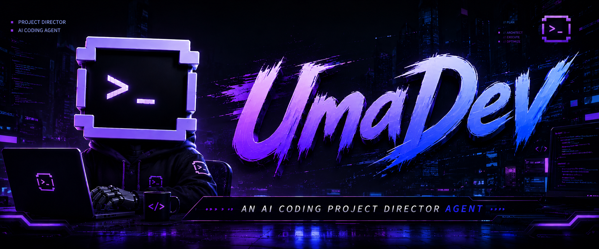
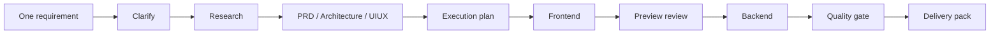
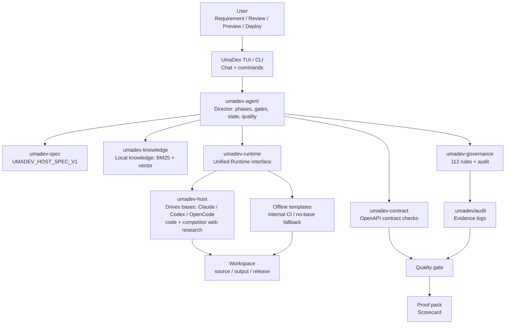
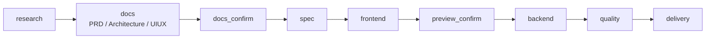
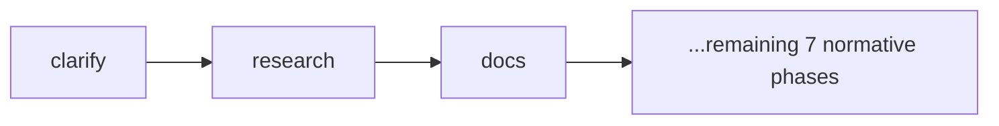
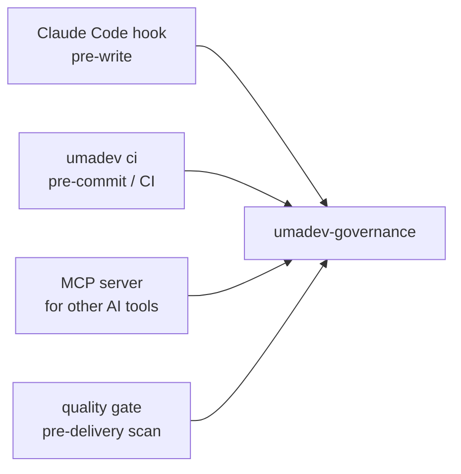
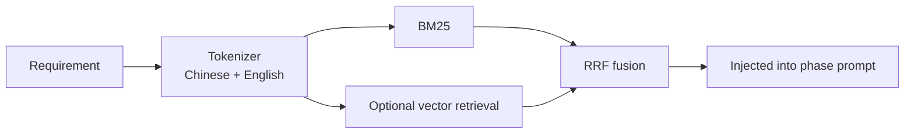

# UmaDev

<div align="center">



### Turn AI coding tools into a real project-director Agent

**From one requirement to PRD, architecture, UI/UX, code, quality gate, and delivery pack.**

[](LICENSE)
[](https://www.rust-lang.org/)
[](spec/UMADEV_HOST_SPEC_V1.md)
[](CHANGELOG.md)

[简体中文](README.md) | [繁體中文](README.zh-TW.md) | English

</div>

---

## Table of Contents

- [Introduction](#introduction) · [Project Origin](#project-origin) · [What Problem It Solves](#what-problem-it-solves)
- [Quick Start](#quick-start) · [Example Flow](#example-flow) · [How It Works](#how-it-works)
- [Runtime Modes](#runtime-modes) · [Pipeline Design](#pipeline-design) · [Quality Gate](#quality-gate)
- [Governance](#governance) · [Knowledge Base](#knowledge-base) · [Deliverables](#deliverables)
- [**Commands**](#commands) · [Configuration](#configuration) · [Rust Architecture](#rust-architecture) · [Development](#development)

## Introduction

UmaDev is a local project-director Agent for AI coding. It does not replace Claude Code, Codex, or OpenCode, and it does not sell a model API. It works one level above them:

1. **It turns a requirement into a full delivery process**: clarify, research, PRD, architecture, UI/UX, frontend, backend, quality gate, delivery.
2. **It drives the AI coding tool you already logged into**: Claude Code / Codex / OpenCode do the actual coding; UmaDev makes them follow the process.
3. **It makes delivery inspectable, resumable, and auditable**: every phase writes artifacts, every important action leaves evidence, and the final run produces a quality report and proof pack.

If an AI coding tool is a very capable engineer, UmaDev acts more like:

> Product manager + architect + UI/UX reviewer + tech lead + QA + delivery manager.

You type one requirement. UmaDev turns "AI writes code" into a complete software delivery workflow.

## Project Origin

UmaDev evolved from the original [shangyankeji/super-dev](https://github.com/shangyankeji/super-dev) project.

Early `super-dev` was closer to an **AI coding governance tool**. It focused on what AI-generated code must not contain, such as emoji icons, hardcoded colors, and unsafe code patterns.

UmaDev is now a full Agent:

- **From governance tool to project-director Agent**: it no longer only checks code; it manages the full journey from requirement to delivery.
- **From loose scripts to a spec-driven system**: the source of truth is [UMADEV_HOST_SPEC_V1](spec/UMADEV_HOST_SPEC_V1.md).
- **Rewritten in Rust**: one binary, fast startup, low dependency surface, cross-platform distribution.
- **From blocking bad output to guiding the base agent**: Claude Code / Codex / OpenCode are the brain and hands; UmaDev is the director and process engine.

In short:

> `super-dev` asked "how do we stop AI from writing bad code?" UmaDev asks "how do we make AI deliver a complete, shippable, auditable project?"

## What Problem It Solves

Most people hit the same problems when they first use AI coding tools:

- The AI starts coding immediately, without a PRD, architecture, or acceptance criteria.
- The frontend is built, but backend API paths do not match.
- The UI looks generic: random colors, random fonts, template-like composition.
- The AI leaves placeholders, fake data, TODOs, and still says "done".
- After one requirement change, context drifts and earlier decisions are forgotten.
- Code exists, but there is no quality report or delivery evidence.
- Your team has standards and internal knowledge, but you keep copying them manually into prompts.

UmaDev turns those problems into a structured workflow.



## Quick Start

### 1. Install

```bash
npm install -g umadev
```

The npm package is only a distribution shim. The actual program is a Rust binary.

Supported platforms:

- macOS Apple Silicon
- macOS Intel
- Linux x86_64
- Linux ARM64
- Windows x86_64

Build from source:

```bash
git clone https://github.com/umacloud/umadev.git
cd umadev
cargo build --release
./target/release/umadev --version
```

### 2. Prepare an AI Coding Base

UmaDev is designed to drive a CLI you already installed and logged into:

```bash
# Pick one
npm install -g @anthropic-ai/claude-code
npm install -g @openai/codex
npm install -g opencode-ai
```

Then log in using that tool's own authentication flow.

UmaDev does not store your Claude / Codex / OpenCode login. It only sends tasks to those CLIs in non-interactive mode.

### 3. Initialize a Project

```bash
cd your-project
umadev init
```

This writes:

```text
umadev.yaml              # Declares this as a UmaDev-managed project
.umadevrc               # Project-level config
.umadev/rules.toml      # Governance policy
CLAUDE.md               # Instructions for Claude Code
.gitignore              # Ignores UmaDev runtime artifacts
knowledge/              # Project knowledge and design-system seeds
```

### 4. Launch

```bash
umadev
```

On first launch, choose:

1. UI language.
2. Which base CLI to drive: Claude Code, Codex, or OpenCode (the one you're logged into).

Then type a requirement:

```text
Build a SaaS subscription admin dashboard for indie developers, with login, pricing plans, billing history, and an admin overview.
```

UmaDev will begin organizing the delivery workflow.

### 5. Preview and Deliver

After the frontend phase:

```text
/preview
```

After delivery:

```text
/deploy
```

The final evidence lives in:

```text
output/
release/
.umadev/audit/
```

The most important files are:

```text
release/proof-pack-<project>-<time>.zip
release/scorecard-<project>-<time>.html
```

These are the files you can hand to a teammate, client, or reviewer.

## Example Flow

Suppose you run:

```bash
umadev init
umadev
```

Then type:

```text
Build a course-booking mini app. Users can browse courses, pick a time, book, cancel, and admins can manage courses and bookings.
```

UmaDev will:

1. **Clarify the requirement** — fill in sensible defaults for target platform, payment scope, and admin complexity (auto mode self-resolves without interrupting you; manual mode lets you confirm each).
2. **Research the web** — when the base has web access, search competing mini apps / booking systems (features, pricing, design trends, real user reviews) AND retrieve built-in knowledge about booking systems, admin CRUD, permissions, and form validation. Both are merged into `output/<slug>-research.md`.
3. Generate a PRD with roles, scope, and EARS testable acceptance criteria.
4. Generate architecture with data model, APIs, auth, and deployment notes.
5. Generate UI/UX with design direction, tokens, typography, component states, and icon library.
6. Create an execution plan and task list (each task links back to its FR id).
7. Drive the selected base to implement the frontend.
8. Pause for preview.
9. Drive backend and integration work.
10. Run the quality gate.
11. Produce the delivery pack and scorecard.

This is not "AI chatted and said done". It leaves real artifacts on disk.

## How It Works

UmaDev has four conceptual layers:



In plain English:

- **TUI/CLI** is where you talk to UmaDev.
- **Agent Runner** decides which phase runs next and when to pause.
- **Research (phase 1)**: the base first researches competitors / trends / real reviews on the web, layered with the local knowledge base, producing `research.md` — it never jumps straight to code.
- **Runtime / base** hands work to the base you're logged into (Claude Code / Codex / OpenCode) — the base uses its OWN login and model, both writing real code and doing the competitor web research; UmaDev injects and overrides nothing.
- **Governance/Quality** checks the generated work.
- **Knowledge** injects engineering standards, design systems, and domain context (local BM25 + vector retrieval).
- **Evidence** records what happened and builds the final delivery pack.

## Runtime Modes

### Mode A: Drive a Local AI Coding CLI

Recommended.

| Backend ID | Program | How UmaDev calls it | Best for |
|---|---|---|---|
| `claude-code` | `claude` | `claude --print --output-format text` | Claude Code users |
| `codex` | `codex` | `codex exec --sandbox workspace-write` | Codex CLI users |
| `opencode` | `opencode` | `opencode run` | OpenCode users |

### The Base Brings Its Own Model — UmaDev Has No External API

UmaDev owns no model and connects to no third-party API — **the base uses its own model** (your logged-in subscription, or whatever third-party / local model you configured on the base itself). When you pick a base, UmaDev reads and displays its current model and reasoning effort (`/status` shows them too), but **never overrides** them: by default it passes no `--model`, so the base runs on its own; change the model in the base's own config, or use `/model <id>` to override just this session.

Sources UmaDev reads: claude `~/.claude/settings.json` (`model` / `effortLevel`), codex `~/.codex/config.toml` (`model` / `model_reasoning_effort`), opencode `opencode.json` (`model`; reasoning is baked into the model variant).

### Mode B: Offline Templates

```text
/offline
```

Offline mode makes no model call and no network request. It is useful for demos, smoke tests, and understanding the file layout.

## Pipeline Design

The normative pipeline has 9 phases:



The product also adds a pre-research `clarify` micro-phase:



### Phase Outputs

| Phase | Meaning | Main files |
|---|---|---|
| `clarify` | Ask and collect requirement clarification | `output/<slug>-clarify.md`, `output/<slug>-clarify-answers.md` |
| `research` | Web research: competitors, domain, risks, design trends | `output/<slug>-research.md` |
| `docs` | Core documents | `output/<slug>-prd.md`, `output/<slug>-architecture.md`, `output/<slug>-uiux.md` |
| `docs_confirm` | Review checkpoint | `.umadev/workflow-state.json` |
| `spec` | Execution plan and tasks | `output/<slug>-execution-plan.md`, `.umadev/changes/<id>/tasks.md` |
| `frontend` | Frontend implementation notes | `output/<slug>-frontend-notes.md` |
| `preview_confirm` | Preview checkpoint | TUI gate state |
| `backend` | Backend and integration notes | `output/<slug>-backend-notes.md` |
| `quality` | Independent quality checks | `output/<slug>-quality-gate.json`, `output/<slug>-quality-gate.md` |
| `delivery` | Final delivery | `output/<slug>-delivery-notes.md`, `release/proof-pack-*.zip`, `release/scorecard-*.html` |

## Quality Gate

The quality gate is UmaDev's pre-delivery review.

It checks:

- PRD goal, scope, and acceptance criteria.
- Architecture APIs, data model, error handling, and auth.
- UI/UX tokens, typography, icon library, component states, and dark mode.
- Frontend API calls versus backend contract.
- Emoji icons, hardcoded colors, and generic AI-template UI patterns.
- Build, test, lint, and typecheck results.
- Dockerfile, CI, migrations, and `.env.example`.
- Leaked API keys, passwords, and connection strings.
- Audit logs and compliance mapping.

Outputs:

```text
output/<slug>-quality-gate.json
output/<slug>-quality-gate.md
```

Default threshold:

```toml
[quality]
threshold = 90
skip_checks = []
```

## Governance

UmaDev started as a governance tool, and that remains a core capability.

The spec layer has 25 clauses. The implementation currently includes 112 governance checks across UI quality, security, frontend architecture, backend engineering, and language-specific hazards.

Governance entry points:



Project policy:

```toml
[disabled]
clauses = []

[exclusions]
paths = ["src/legacy/**", "**/*.test.ts"]

[extra]
blocked_domains = ["internal-bad-proxy.corp"]
```

## Knowledge Base

UmaDev ships with 416 markdown knowledge files. They are not generic docs; they are engineering standards meant to be injected into the AI base.

They cover product, PRD, architecture, frontend, backend, database, security, testing, CI/CD, operations, mobile, desktop, mini programs, HarmonyOS, cross-platform development, industries, UI/UX, design systems, and expert methodologies.

Retrieval flow:



Add your own knowledge:

```bash
umadev knowledge-manage add ./team-docs --name team-docs
umadev knowledge-manage search "payment webhook idempotency"
```

## Deliverables

After a full run:

```text
your-project/
  output/
    app-clarify.md
    app-research.md
    app-prd.md
    app-architecture.md
    app-uiux.md
    app-execution-plan.md
    app-frontend-notes.md
    app-backend-notes.md
    app-quality-gate.json
    app-quality-gate.md
    app-compliance-mapping.json
    app-delivery-notes.md

  .umadev/
    workflow-state.json
    audit/
      tool-calls.jsonl
      frontend-api-calls.jsonl
      verify.jsonl

  release/
    proof-pack-app-20260620090000.zip
    proof-pack-app-20260620090000.manifest.txt
    scorecard-app-20260620090000.html
```

## Commands

UmaDev has two entry points that mirror each other:

- **TUI slash commands** — type `/` inside the `umadev` chat (recommended for daily use).
- **Terminal CLI subcommands** — for scripts / CI, no TUI needed.

> Tip: typing `/` in the TUI opens a command palette — `Tab` to autocomplete, `↑↓` to cycle. `/help` (or F1) lists every command and keybinding.

### TUI slash commands

**Pick the "brain" and model**

| Command | What it does |
|---|---|
| `/claude` · `/codex` · `/opencode` | Switch the base CLI being driven (saved to `~/.umadev/config.toml`) |
| `/offline` | Switch to deterministic offline templates (demo / CI, zero network) |
| `/status` | Active base + its **driving model** and **reasoning effort** (read from the base's own config; UmaDev never overrides) |
| `/model <id>` | Override the model for this session only (by default UmaDev passes none, so the base uses its own) |
| `/kind <type>` | Set task type (fullstack / frontend-only / backend-only / bugfix / refactor) to tailor the phases |

**Drive the flow & gates**

| Command | What it does |
|---|---|
| just type | Sent to the base, which decides chat-vs-run; if a gate is open, it counts as a revision |
| `/run <requirement>` | Explicitly start a pipeline |
| `/continue` (or `c` at a gate) | Approve the current gate, advance to the next phase |
| `/revise <feedback>` | Stay at the gate, redo this phase with feedback |
| `/manual` · `/auto` | Toggle per-gate review / full autonomy (default `auto`; `shift+Tab` also toggles) |
| `/redo` | Re-run the previous phase block |
| `/abort` · `/stop` | Abort the current run (on-disk state is kept; resumable later) |

**Preview & delivery**

| Command | What it does |
|---|---|
| `/preview` | Start the frontend dev server + open the browser |
| `/stop-preview` | Stop the preview server |
| `/deploy` | **Preview** the deploy command (look, don't run) |
| `/deploy confirm` | Actually run the deploy |

**Checkpoints & rewind** (shadow git — never touches your own `.git`)

| Command | What it does |
|---|---|
| `/checkpoint [label]` | Snapshot the workspace files |
| `/rewind [id]` | List / roll back to a file checkpoint |

**Inspect artifacts & state**

| Command | What it does |
|---|---|
| `/spec` | The full `UMADEV_HOST_SPEC_V1` spec |
| `/diff [name]` | Show an artifact (default `prd`; also `architecture` / `uiux` / …) |
| `/verify` | Workspace conformance report + evidence chain |
| `/doctor` | Self-test (binary / manifest / probes) |
| `/status` | Current phase / gate / run state |
| `/history` | Full conversation history |
| `/usage` | Token / usage stats |
| `/knowledge` | Knowledge-base hits for this run |
| `/skill` · `/mcp` | Installed Skills / MCP servers |
| `/config` | Effective configuration |

**Design & project**

| Command | What it does |
|---|---|
| `/design <direction>` | Lock the design-system direction (`modern-minimal` / `editorial-clean` / …) |
| `/template <name>` | Pick a scaffold template |
| `/name <name>` | Set the project slug |
| `/init` | Write the `umadev.yaml` manifest |

**General**

| Command | What it does |
|---|---|
| `/help` (or F1) | Help overlay (all keybindings) |
| `/clear` | Clear the chat |
| `/export` | Export the current session |
| `/quit` (or Esc) | Exit (workflow state is saved, resumable) |

### Terminal CLI subcommands

**Workspace lifecycle**

| Command | What it does |
|---|---|
| `umadev init` | Scaffold the workspace (`umadev.yaml` + design-system / template / knowledge seeds) |
| `umadev` (no subcommand) | Launch the chat TUI |
| `umadev doctor` | Self-test |
| `umadev verify` | Workspace conformance + evidence-chain status |
| `umadev report` | Compliance map (SOC 2 / ISO 27001 / EU AI Act) |
| `umadev history` | List rollback snapshots |
| `umadev rollback latest` | Roll back to a snapshot |
| `umadev update` | Upgrade UmaDev to the latest version (via npm) |
| `umadev uninstall` | Clean uninstall: confirm, then remove `~/.umadev` + this project's governance hooks + the binary (add `--base <claude-code\|pre-commit>` for hook-only) |

**Non-interactive run (scripts / CI)**

| Command | What it does |
|---|---|
| `umadev run "<requirement>" --backend <id>` | Run a pipeline, pausing at the `docs_confirm` gate |
| `umadev continue [--backend <id>]` | Approve the current gate (reuses the last `--backend`) |
| `umadev revise "<feedback>"` | Stay at the gate, record a change and re-run the block |
| `umadev spec [--clauses]` | Print the spec (`--clauses` for the clause table) |

**Governance / CI**

| Command | What it does |
|---|---|
| `umadev ci [--changed-only] [--report-only]` | Run governance over every source file (CI mode) |
| `umadev install --base <claude-code\|pre-commit\|…>` | Install the pre-write governance hook into a base CLI or git pre-commit |

**Platform extensions**

| Command | What it does |
|---|---|
| `umadev mcp serve` | Run as an MCP server — expose `govern_file` / `govern_command` to Claude Desktop / Cursor / Continue / … |
| `umadev mcp-manage <install\|list\|remove>` | Manage the base CLI's MCP servers |
| `umadev skill <install\|list\|remove>` | Manage Skills (knowledge + rules + prompt packs) |
| `umadev knowledge-manage <add\|list\|search\|remove>` | Manage custom knowledge-base docs |

**Help**

| Command | What it does |
|---|---|
| `umadev examples` | Command cheat-sheet |
| `umadev guide` | 60-second walkthrough |

### Common environment variables

| Variable | What it does | Default |
|---|---|---|
| `UMADEV_CLAUDE_BIN` / `UMADEV_CODEX_BIN` | Path to the `claude` / `codex` binary | `claude` / `codex` |
| `UMADEV_WORKER_TIMEOUT` | Per-call worker timeout (seconds) | `300` |
| `UMADEV_VERIFY_TIMEOUT_SECS` | verify-loop per-call timeout (seconds) | `120` |
| `UMADEV_MODEL_PLAN` / `UMADEV_MODEL_BUILD` | Per-phase model tiers (same as `/model plan\|build`) | — |
| `OPENAI_EMBED_KEY` | Enable remote vector embeddings (else bundled local model + BM25) | — |
| `XDG_CONFIG_HOME` | Base dir for `config.toml` | `$HOME` |

## Configuration

User config:

```text
~/.umadev/config.toml
```

```toml
backend = "claude-code"
lang = "en"
# model is optional — leave it empty and the base uses its OWN configured model;
# only set it (or use /model <id>) to override a session.
# model = "opus"
```

Project config:

```text
.umadevrc
```

```toml
[quality]
threshold = 90
skip_checks = []

[pipeline]
skip_phases = []
max_review_rounds = 3
auto_approve_gates = true

[knowledge]
enabled = true
engine = "hybrid"
top_k = 6
```

## Rust Architecture

UmaDev is a 10-crate Rust workspace.

| Crate | Human meaning | Technical role |
|---|---|---|
| `umadev` | Main program | CLI, TUI entry, doctor, hook, CI, MCP/Skill/Knowledge management |
| `umadev-spec` | Rule book | Rust data for `UMADEV_HOST_SPEC_V1` |
| `umadev-governance` | Quality and red lines | 112 checks, audit, policy, compliance mapping |
| `umadev-agent` | Project director | Runner, gates, state, quality, delivery pack |
| `umadev-runtime` | Unified brain interface | Offline, HTTP runtime, Runtime trait |
| `umadev-host` | CLI driver | Claude Code, Codex, OpenCode subprocess drivers |
| `umadev-contract` | API reconciler | OpenAPI contract and frontend/backend path checks |
| `umadev-knowledge` | Knowledge retrieval | BM25, chunks, tokenizer, optional vector |
| `umadev-tui` | Terminal interface | ratatui chat UI, preview/deploy commands |
| `umadev-i18n` | Languages | Simplified Chinese, Traditional Chinese, English |

## Development

Requirements:

- Rust 1.87+
- Cargo
- Node.js 18+ only if testing npm distribution

Commands:

```bash
cargo build --workspace
cargo test --workspace
cargo clippy --workspace --all-targets -- -D warnings
cargo fmt --all
```

Recommended reading order:

1. [spec/UMADEV_HOST_SPEC_V1.md](spec/UMADEV_HOST_SPEC_V1.md)
2. [crates/umadev-spec/src/lib.rs](crates/umadev-spec/src/lib.rs)
3. [crates/umadev-agent/src/runner.rs](crates/umadev-agent/src/runner.rs)
4. [crates/umadev-governance/src/rules.rs](crates/umadev-governance/src/rules.rs)
5. [crates/umadev/src/main.rs](crates/umadev/src/main.rs)

## License

MIT. See [LICENSE](LICENSE).
