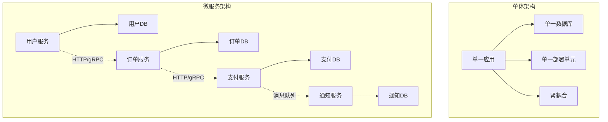
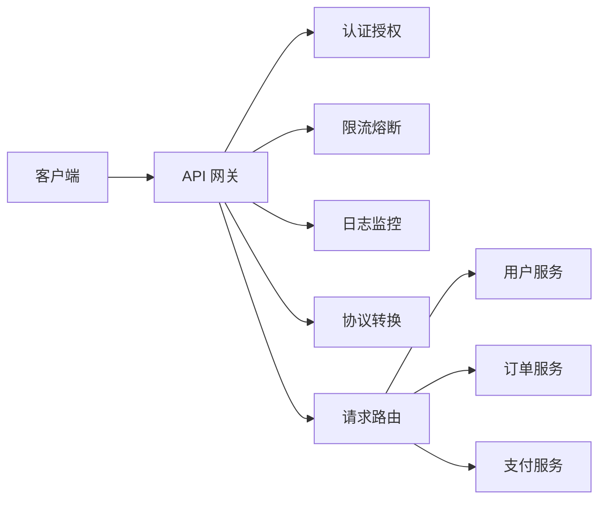

# 微服务架构模式完全指南

## 概述

微服务架构是一种将单一应用程序开发为一组小型服务的方法,每个服务运行在自己的进程中,并使用轻量级机制(通常是 HTTP Resource API)进行通信。每个服务都是围绕业务能力构建的,并可以由全自动部署机制独立部署。这些服务可以用不同的编程语言编写,使用不同的数据存储技术。

本指南将全面讲解微服务架构的核心模式、设计原则、实施策略以及生产环境中的最佳实践。

## 核心概念

### 1. 微服务 vs 单体架构



#### 微服务的优势

| 优势 | 说明 |
|------|------|
| **独立部署** | 每个服务可以独立部署,不影响其他服务 |
| **技术多样性** | 不同服务可以使用最适合的技术栈 |
| **故障隔离** | 一个服务失败不会导致整个系统崩溃 |
| **可扩展性** | 可以单独扩展瓶颈服务 |
| **团队自治** | 不同团队可以独立开发和维护服务 |

#### 微服务的挑战

| 挑战 | 说明 |
|------|------|
| **分布式复杂性** | 网络延迟、部分失败、分布式事务 |
| **运维复杂性** | 需要自动化部署、监控、日志聚合 |
| **数据一致性** | 跨服务的数据一致性难以保证 |
| **测试复杂性** | 需要集成测试和端到端测试 |
| **服务发现** | 服务实例动态变化,需要服务发现机制 |

### 2. 微服务设计原则

#### 单一职责原则 (SRP)

每个微服务应该只负责一个业务能力:

```python
# ❌ 错误: 服务职责过多
class UserOrderService:
    def create_user(self): pass
    def create_order(self): pass
    def process_payment(self): pass
    def send_notification(self): pass

# ✅ 正确: 职责单一
class UserService:
    def create_user(self): pass
    def update_user(self): pass
    def get_user(self): pass

class OrderService:
    def create_order(self): pass
    def update_order(self): pass

class PaymentService:
    def process_payment(self): pass

class NotificationService:
    def send_notification(self): pass
```

#### 围绕业务能力建模

使用领域驱动设计 (DDD) 的限界上下文 (Bounded Context):

```python
# 用户上下文
class User:
    def __init__(self, user_id, email, name):
        self.user_id = user_id
        self.email = email
        self.name = name

# 订单上下文
class Order:
    def __init__(self, order_id, customer_id, items):
        self.order_id = order_id
        self.customer_id = customer_id  # 只存储 ID,不存储完整用户信息
        self.items = items
        self.status = "pending"

# 支付上下文
class Payment:
    def __init__(self, payment_id, order_id, amount):
        self.payment_id = payment_id
        self.order_id = order_id
        self.amount = amount
```

## 核心模式

### 1. API 网关模式 (API Gateway)

#### 问题
客户端需要与多个服务通信,导致:
- 多次网络请求
- 跨域问题
- 协议转换复杂
- 认证逻辑重复

#### 解决方案

```python
from fastapi import FastAPI, HTTPException, Depends
from pydantic import BaseModel
import httpx

app = FastAPI()

class Gateway:
    def __init__(self):
        self.services = {
            "user": "http://user-service:8001",
            "order": "http://order-service:8002",
            "product": "http://product-service:8003"
        }
        self.client = httpx.AsyncClient()
    
    async def call_service(self, service_name: str, path: str, method: str = "GET", data=None):
        base_url = self.services.get(service_name)
        if not base_url:
            raise HTTPException(status_code=404, detail="Service not found")
        
        url = f"{base_url}{path}"
        
        try:
            if method == "GET":
                response = await self.client.get(url)
            elif method == "POST":
                response = await self.client.post(url, json=data)
            elif method == "PUT":
                response = await self.client.put(url, json=data)
            elif method == "DELETE":
                response = await self.client.delete(url)
            
            return response.json()
        except httpx.RequestError as e:
            raise HTTPException(status_code=503, detail=f"Service unavailable: {str(e)}")

gateway = Gateway()

# API 网关路由
@app.get("/api/users/{user_id}")
async def get_user(user_id: int):
    return await gateway.call_service("user", f"/users/{user_id}")

@app.post("/api/orders")
async def create_order(order_data: dict):
    # 1. 验证用户
    user = await gateway.call_service("user", f"/users/{order_data['user_id']}")
    if not user:
        raise HTTPException(status_code=404, detail="User not found")
    
    # 2. 验证产品
    products = await gateway.call_service("product", "/products/batch", "POST", 
                                          {"product_ids": order_data['product_ids']})
    
    # 3. 创建订单
    order = await gateway.call_service("order", "/orders", "POST", {
        "user_id": order_data['user_id'],
        "products": products,
        "total": sum(p['price'] for p in products)
    })
    
    return order
```

#### API 网关职责



### 2. 服务发现模式 (Service Discovery)

#### 问题
在动态环境中,服务实例的网络地址会动态变化,客户端如何知道服务地址?

#### 解决方案: 服务注册中心

```python
# 服务注册中心
import asyncio
from datetime import datetime, timedelta
from typing import Dict, List
from dataclasses import dataclass

@dataclass
class ServiceInstance:
    service_name: str
    instance_id: str
    host: str
    port: int
    last_heartbeat: datetime
    metadata: dict

class ServiceRegistry:
    def __init__(self, heartbeat_timeout: int = 30):
        self.services: Dict[str, List[ServiceInstance]] = {}
        self.heartbeat_timeout = heartbeat_timeout
    
    def register(self, service_name: str, instance_id: str, host: str, port: int, metadata: dict = None):
        """服务注册"""
        if service_name not in self.services:
            self.services[service_name] = []
        
        instance = ServiceInstance(
            service_name=service_name,
            instance_id=instance_id,
            host=host,
            port=port,
            last_heartbeat=datetime.now(),
            metadata=metadata or {}
        )
        
        # 检查是否已存在
        existing = next((i for i in self.services[service_name] 
                        if i.instance_id == instance_id), None)
        if existing:
            self.services[service_name].remove(existing)
        
        self.services[service_name].append(instance)
        print(f"Registered: {service_name} at {host}:{port}")
    
    def deregister(self, service_name: str, instance_id: str):
        """服务注销"""
        if service_name in self.services:
            self.services[service_name] = [
                i for i in self.services[service_name] 
                if i.instance_id != instance_id
            ]
            print(f"Deregistered: {service_name}/{instance_id}")
    
    def heartbeat(self, service_name: str, instance_id: str):
        """心跳更新"""
        if service_name in self.services:
            instance = next((i for i in self.services[service_name] 
                           if i.instance_id == instance_id), None)
            if instance:
                instance.last_heartbeat = datetime.now()
    
    def get_instances(self, service_name: str) -> List[ServiceInstance]:
        """获取健康的服务实例"""
        if service_name not in self.services:
            return []
        
        # 过滤掉超时的实例
        now = datetime.now()
        healthy = [
            i for i in self.services[service_name]
            if (now - i.last_heartbeat).total_seconds() < self.heartbeat_timeout
        ]
        
        return healthy
    
    def cleanup_expired(self):
        """清理过期实例"""
        now = datetime.now()
        for service_name in list(self.services.keys()):
            before_count = len(self.services[service_name])
            self.services[service_name] = [
                i for i in self.services[service_name]
                if (now - i.last_heartbeat).total_seconds() < self.heartbeat_timeout
            ]
            after_count = len(self.services[service_name])
            if before_count != after_count:
                print(f"Cleaned up {before_count - after_count} expired instances for {service_name}")

# 使用示例
registry = ServiceRegistry()

# 服务启动时注册
registry.register("user-service", "instance-1", "192.168.1.10", 8001, {"version": "1.0"})
registry.register("user-service", "instance-2", "192.168.1.11", 8001, {"version": "1.0"})

# 客户端发现服务
instances = registry.get_instances("user-service")
print(f"Available instances: {len(instances)}")
for instance in instances:
    print(f"  - {instance.host}:{instance.port}")
```

#### 客户端负载均衡

```python
import random
from typing import List

class LoadBalancer:
    """负载均衡器"""
    
    @staticmethod
    def round_robin(instances: List[ServiceInstance], index: int) -> ServiceInstance:
        """轮询策略"""
        return instances[index % len(instances)]
    
    @staticmethod
    def random_choice(instances: List[ServiceInstance]) -> ServiceInstance:
        """随机策略"""
        return random.choice(instances)
    
    @staticmethod
    def weighted_random(instances: List[ServiceInstance]) -> ServiceInstance:
        """加权随机"""
        weights = [i.metadata.get('weight', 1) for i in instances]
        return random.choices(instances, weights=weights)[0]
    
    @staticmethod
    def least_connections(instances: List[ServiceInstance]) -> ServiceInstance:
        """最少连接数"""
        return min(instances, key=lambda i: i.metadata.get('connections', 0))

# 使用示例
class ServiceClient:
    def __init__(self, registry: ServiceRegistry, load_balancer=LoadBalancer.round_robin):
        self.registry = registry
        self.load_balancer = load_balancer
        self.call_count = {}
    
    async def call(self, service_name: str, path: str):
        # 获取实例列表
        instances = self.registry.get_instances(service_name)
        if not instances:
            raise Exception(f"No available instances for {service_name}")
        
        # 负载均衡选择实例
        if service_name not in self.call_count:
            self.call_count[service_name] = 0
        
        instance = self.load_balancer(instances, self.call_count[service_name])
        self.call_count[service_name] += 1
        
        # 发起调用
        url = f"http://{instance.host}:{instance.port}{path}"
        print(f"Calling {url}")
        # 实际调用逻辑...
        return {"status": "ok", "url": url}

client = ServiceClient(registry)
result = await client.call("user-service", "/users/123")
```

### 3. 熔断器模式 (Circuit Breaker)

#### 问题
当服务不可用时,客户端持续调用会导致:
- 资源耗尽
- 级联失败
- 响应时间过长

#### 解决方案

```python
import time
from enum import Enum
from typing import Callable
from functools import wraps

class CircuitState(Enum):
    CLOSED = "closed"        # 正常状态
    OPEN = "open"            # 熔断状态
    HALF_OPEN = "half_open"  # 半开状态

class CircuitBreaker:
    """熔断器"""
    
    def __init__(
        self,
        failure_threshold: int = 5,
        timeout: int = 60,
        success_threshold: int = 3
    ):
        self.failure_threshold = failure_threshold
        self.timeout = timeout
        self.success_threshold = success_threshold
        
        self.failure_count = 0
        self.success_count = 0
        self.state = CircuitState.CLOSED
        self.last_failure_time = None
    
    def call(self, func: Callable, *args, **kwargs):
        """执行函数调用"""
        if self.state == CircuitState.OPEN:
            # 检查是否可以进入半开状态
            if self._should_attempt_reset():
                self.state = CircuitState.HALF_OPEN
            else:
                raise Exception("Circuit breaker is OPEN")
        
        try:
            result = func(*args, **kwargs)
            self._on_success()
            return result
        except Exception as e:
            self._on_failure()
            raise e
    
    def _should_attempt_reset(self) -> bool:
        """检查是否应该尝试重置"""
        if self.last_failure_time is None:
            return False
        
        elapsed = time.time() - self.last_failure_time
        return elapsed >= self.timeout
    
    def _on_success(self):
        """成功回调"""
        self.failure_count = 0
        
        if self.state == CircuitState.HALF_OPEN:
            self.success_count += 1
            if self.success_count >= self.success_threshold:
                self.state = CircuitState.CLOSED
                self.success_count = 0
                print("Circuit breaker reset to CLOSED")
    
    def _on_failure(self):
        """失败回调"""
        self.failure_count += 1
        self.last_failure_time = time.time()
        self.success_count = 0
        
        if self.failure_count >= self.failure_threshold:
            self.state = CircuitState.OPEN
            print("Circuit breaker opened due to failures")

# 装饰器方式使用
def circuit_breaker(failure_threshold=5, timeout=60):
    """熔断器装饰器"""
    breaker = CircuitBreaker(failure_threshold, timeout)
    
    def decorator(func):
        @wraps(func)
        def wrapper(*args, **kwargs):
            return breaker.call(func, *args, **kwargs)
        
        # 暴露熔断器状态
        wrapper.breaker = breaker
        return wrapper
    
    return decorator

# 使用示例
@circuit_breaker(failure_threshold=3, timeout=10)
def call_external_service(url):
    """调用外部服务"""
    # 模拟随机失败
    import random
    if random.random() < 0.7:
        raise Exception("Service unavailable")
    return {"data": "success"}

# 测试
for i in range(10):
    try:
        result = call_external_service("http://example.com/api")
        print(f"Call {i+1}: Success - {result}")
    except Exception as e:
        print(f"Call {i+1}: Failed - {e}")
        if "Circuit breaker is OPEN" in str(e):
            print("  ⚠️  Circuit breaker is open, stopping calls")
            break
```

### 4. 服务间通信模式

#### 同步通信: REST/gRPC

```python
# REST API 示例 (FastAPI)
from fastapi import FastAPI, HTTPException
from pydantic import BaseModel

app = FastAPI()

class User(BaseModel):
    id: int
    name: str
    email: str

# 用户服务
users_db = {
    1: User(id=1, name="Alice", email="alice@example.com"),
    2: User(id=2, name="Bob", email="bob@example.com")
}

@app.get("/users/{user_id}", response_model=User)
async def get_user(user_id: int):
    user = users_db.get(user_id)
    if not user:
        raise HTTPException(status_code=404, detail="User not found")
    return user

# 订单服务调用用户服务
import httpx

async def get_user_from_user_service(user_id: int):
    """从用户服务获取用户信息"""
    async with httpx.AsyncClient() as client:
        response = await client.get(f"http://user-service:8001/users/{user_id}")
        if response.status_code == 200:
            return response.json()
        return None
```

#### 异步通信: 消息队列

```python
# 使用 RabbitMQ 的示例
import pika
import json
from typing import Callable

class MessageQueue:
    """消息队列封装"""
    
    def __init__(self, host='localhost'):
        self.connection = pika.BlockingConnection(
            pika.ConnectionParameters(host=host)
        )
        self.channel = self.connection.channel()
    
    def publish(self, queue_name: str, message: dict):
        """发布消息"""
        self.channel.queue_declare(queue=queue_name)
        
        self.channel.basic_publish(
            exchange='',
            routing_key=queue_name,
            body=json.dumps(message),
            properties=pika.BasicProperties(
                delivery_mode=2,  # 持久化
            )
        )
        print(f"Published to {queue_name}: {message}")
    
    def consume(self, queue_name: str, callback: Callable):
        """消费消息"""
        self.channel.queue_declare(queue=queue_name)
        
        def on_message(ch, method, properties, body):
            message = json.loads(body)
            callback(message)
            ch.basic_ack(delivery_tag=method.delivery_tag)
        
        self.channel.basic_qos(prefetch_count=1)
        self.channel.basic_consume(queue=queue_name, on_message_callback=on_message)
        
        print(f"Consuming from {queue_name}...")
        self.channel.start_consuming()
    
    def close(self):
        """关闭连接"""
        self.connection.close()

# 使用示例
mq = MessageQueue()

# 订单服务发布订单创建事件
order_created = {
    "event": "order_created",
    "order_id": 123,
    "user_id": 1,
    "total": 99.99
}
mq.publish("order_events", order_created)

# 通知服务订阅订单事件
def handle_order_event(message):
    if message["event"] == "order_created":
        print(f"Sending notification for order {message['order_id']}")
        # 发送邮件/短信通知...

# mq.consume("order_events", handle_order_event)
```

### 5. 事件溯源模式 (Event Sourcing)

#### 问题
传统 CRUD 只保存当前状态,丢失了历史变更信息

#### 解决方案

```python
from typing import List
from datetime import datetime
from dataclasses import dataclass
import json

@dataclass
class Event:
    event_type: str
    aggregate_id: str
    timestamp: str
    data: dict

class EventStore:
    """事件存储"""
    
    def __init__(self):
        self.events: List[Event] = []
    
    def append(self, event: Event):
        self.events.append(event)
        print(f"Event stored: {event.event_type} for {event.aggregate_id}")
    
    def get_events(self, aggregate_id: str) -> List[Event]:
        """获取聚合的所有事件"""
        return [e for e in self.events if e.aggregate_id == aggregate_id]

# 订单聚合根
class Order:
    """订单聚合根 (使用事件溯源)"""
    
    def __init__(self, order_id: str):
        self.order_id = order_id
        self.status = None
        self.items = []
        self.total = 0
        self.version = 0
    
    def create(self, items: List[dict]):
        """创建订单"""
        if self.version > 0:
            raise Exception("Order already created")
        
        event = Event(
            event_type="OrderCreated",
            aggregate_id=self.order_id,
            timestamp=datetime.now().isoformat(),
            data={"items": items}
        )
        self._apply(event)
        return event
    
    def confirm(self):
        """确认订单"""
        if self.status != "pending":
            raise Exception("Can only confirm pending orders")
        
        event = Event(
            event_type="OrderConfirmed",
            aggregate_id=self.order_id,
            timestamp=datetime.now().isoformat(),
            data={}
        )
        self._apply(event)
        return event
    
    def cancel(self, reason: str):
        """取消订单"""
        if self.status == "shipped":
            raise Exception("Cannot cancel shipped orders")
        
        event = Event(
            event_type="OrderCancelled",
            aggregate_id=self.order_id,
            timestamp=datetime.now().isoformat(),
            data={"reason": reason}
        )
        self._apply(event)
        return event
    
    def _apply(self, event: Event):
        """应用事件"""
        if event.event_type == "OrderCreated":
            self.status = "pending"
            self.items = event.data["items"]
            self.total = sum(item["price"] for item in self.items)
        
        elif event.event_type == "OrderConfirmed":
            self.status = "confirmed"
        
        elif event.event_type == "OrderCancelled":
            self.status = "cancelled"
        
        self.version += 1
    
    def load_from_history(self, events: List[Event]):
        """从事件历史重建状态"""
        for event in events:
            self._apply(event)

# 使用示例
event_store = EventStore()

# 创建订单
order = Order("order-123")
event1 = order.create([
    {"product_id": 1, "price": 50.0},
    {"product_id": 2, "price": 30.0}
])
event_store.append(event1)

# 确认订单
event2 = order.confirm()
event_store.append(event2)

# 重建订单状态
new_order = Order("order-123")
history = event_store.get_events("order-123")
new_order.load_from_history(history)

print(f"Order status: {new_order.status}")
print(f"Order total: {new_order.total}")
print(f"Order version: {new_order.version}")
```

## 数据管理模式

### 1. 数据库每服务模式 (Database per Service)

```python
# 用户服务数据库
class UserDatabase:
    def __init__(self):
        self.db = {}  # 实际使用 PostgreSQL
    
    def save(self, user_id, user_data):
        self.db[user_id] = user_data
    
    def get(self, user_id):
        return self.db.get(user_id)

# 订单服务数据库 (独立)
class OrderDatabase:
    def __init__(self):
        self.db = {}  # 实际使用 MongoDB
    
    def save(self, order_id, order_data):
        self.db[order_id] = order_data
    
    def get(self, order_id):
        return self.db.get(order_id)

# 服务只能访问自己的数据库
user_db = UserDatabase()
order_db = OrderDatabase()
```

### 2. Saga 模式 (分布式事务)

```python
from enum import Enum
from typing import List, Callable

class SagaStep:
    """Saga 步骤"""
    def __init__(self, action: Callable, compensation: Callable):
        self.action = action
        self.compensation = compensation

class Saga:
    """Saga 编排器"""
    
    def __init__(self):
        self.steps: List[SagaStep] = []
        self.completed_steps: List[SagaStep] = []
    
    def add_step(self, action: Callable, compensation: Callable):
        """添加步骤"""
        self.steps.append(SagaStep(action, compensation))
        return self
    
    async def execute(self):
        """执行 Saga"""
        try:
            # 正向执行所有步骤
            for step in self.steps:
                await step.action()
                self.completed_steps.append(step)
            
            print("Saga completed successfully")
        
        except Exception as e:
            print(f"Saga failed: {e}, starting compensation...")
            
            # 反向补偿已完成的步骤
            for step in reversed(self.completed_steps):
                try:
                    await step.compensation()
                except Exception as comp_error:
                    print(f"Compensation failed: {comp_error}")
            
            raise e

# 使用示例: 创建订单 Saga
async def create_order_saga(user_id, product_id, amount):
    """创建订单的 Saga"""
    
    saga = Saga()
    
    # 步骤1: 创建订单
    async def create_order():
        print(f"Creating order for user {user_id}")
        # 实际创建订单...
    
    async def cancel_order():
        print(f"Cancelling order for user {user_id}")
        # 实际取消订单...
    
    saga.add_step(create_order, cancel_order)
    
    # 步骤2: 扣减库存
    async def deduct_inventory():
        print(f"Deducting inventory for product {product_id}")
        # 实际扣减库存...
    
    async def restore_inventory():
        print(f"Restoring inventory for product {product_id}")
        # 实际恢复库存...
    
    saga.add_step(deduct_inventory, restore_inventory)
    
    # 步骤3: 扣款
    async def charge_payment():
        print(f"Charging {amount} from user {user_id}")
        # 实际扣款...
    
    async def refund_payment():
        print(f"Refunding {amount} to user {user_id}")
        # 实际退款...
    
    saga.add_step(charge_payment, refund_payment)
    
    # 执行 Saga
    await saga.execute()

# 测试
import asyncio
asyncio.run(create_order_saga(user_id=1, product_id=100, amount=99.99))
```

## 最佳实践

### 1. 服务拆分原则

- ✅ 单一业务能力
- ✅ 高内聚低耦合
- ✅ 独立数据存储
- ✅ 独立部署能力
- ✅ 故障隔离

### 2. 服务间通信最佳实践

```python
# ✅ 使用异步通信减少耦合
async def process_order(order_id):
    # 发布事件,而不是直接调用其他服务
    await event_bus.publish("OrderCreated", {"order_id": order_id})

# ✅ 使用 API 版本管理
@app.get("/api/v1/users/{user_id}")
async def get_user_v1(user_id: int):
    pass

@app.get("/api/v2/users/{user_id}")
async def get_user_v2(user_id: int):
    pass

# ✅ 实现幂等性
processed_orders = set()

async def process_payment(order_id):
    if order_id in processed_orders:
        return {"status": "already_processed"}
    
    # 处理支付...
    processed_orders.add(order_id)
    return {"status": "success"}
```

### 3. 监控和可观测性

```python
from prometheus_client import Counter, Histogram
import logging

# 指标收集
request_count = Counter('http_requests_total', 'Total HTTP requests')
request_latency = Histogram('http_request_duration_seconds', 'HTTP request latency')

@app.middleware("http")
async def monitor_requests(request, call_next):
    request_count.inc()
    
    with request_latency.time():
        response = await call_next(request)
    
    # 日志记录
    logging.info(f"{request.method} {request.url} - {response.status_code}")
    
    return response
```

## 参考资料

### 书籍
- *Building Microservices* by Sam Newman
- *Microservices Patterns* by Chris Richardson
- *Production-Ready Microservices* by Susan J. Fowler

### 文章
- [Microservices Guide by Martin Fowler](https://martinfowler.com/microservices/)
- [Pattern: Microservice Architecture](https://microservices.io/patterns/microservices.html)

---

**知识ID**: `microservices-patterns-complete`  
**领域**: architecture  
**类型**: standards  
**难度**: advanced  
**质量分**: 94  
**维护者**: architecture-team@umadev.com  
**最后更新**: 2026-03-29
