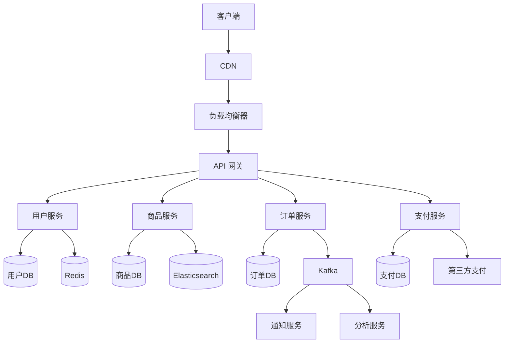

# 开发：Excellent（）
# 功能：系统设计全流程作战手册
# 作用：指导架构师完成从需求分析到详细设计的系统设计全过程
# 创建时间：2026-03-28
# 最后修改：2026-03-28

## 目标

建立系统设计标准化方法论，确保：
- 设计过程可复现、可评审、可追溯
- 容量规划基于量化数据而非拍脑袋
- 可用性设计满足业务 SLA 要求（99.9% ~ 99.99%）
- 数据模型支撑业务演进，避免频繁 Breaking Change
- API 设计符合 RESTful / gRPC 最佳实践，向前兼容
- 设计文档成为团队共识而非个人知识

## 适用场景

- 新系统从零设计
- 现有系统大规模重构
- 关键子系统独立设计（支付/搜索/消息/权限）
- 技术选型评审
- 系统设计面试准备

## 前置条件

### 输入材料

- [ ] 产品需求文档（PRD）已确认且功能范围明确
- [ ] 非功能性需求已量化（QPS / 延迟 / 数据量 / SLA）
- [ ] 利益相关方已识别（产品/开发/运维/安全/业务）
- [ ] 技术约束已明确（预算/团队技能栈/现有基础设施/合规）
- [ ] 竞品/类似系统的技术调研已完成

### 工具准备

| 工具 | 用途 |
|------|------|
| Draw.io / Excalidraw | 架构图绘制 |
| PlantUML / Mermaid | 时序图/类图 |
| Notion / Confluence | 设计文档协作 |
| Benchmarking 工具 | wrk / k6 / vegeta |
| 原型工具 | Figma / Sketch（如涉及 UI） |

---

## 一、需求分析

### 1.1 功能性需求梳理

```yaml
用例清单:
  核心用例（Must Have）:
    - UC-001: 用户注册与登录
    - UC-002: 商品浏览与搜索
    - UC-003: 下单与支付
    - UC-004: 订单查询与管理

  重要用例（Should Have）:
    - UC-005: 推荐系统
    - UC-006: 优惠券系统
    - UC-007: 评价系统

  可选用例（Nice to Have）:
    - UC-008: 社交分享
    - UC-009: 直播功能

用例优先级矩阵:
  P0（上线必须）: UC-001 ~ UC-004
  P1（一期后续）: UC-005 ~ UC-007
  P2（二期规划）: UC-008 ~ UC-009
```

### 1.2 非功能性需求量化

```yaml
流量估算:
  DAU: 100 万
  峰值 QPS: DAU × 每用户日均请求 × 峰值系数 / 86400
  # 100万 × 50 × 3 / 86400 ≈ 1736 QPS（读）
  # 写 QPS 通常为读的 1/10 ≈ 174 QPS

  读写比: 10:1
  峰值流量倍数: 日均的 3~5 倍
  突发流量: 秒杀/大促场景 10~100 倍

存储估算:
  单条记录大小: 1 KB（用户）/ 5 KB（订单）/ 0.5 KB（日志）
  日增数据量: 写 QPS × 86400 × 记录大小
  # 174 × 86400 × 5 KB ≈ 72 GB/天（订单）
  年存储量: 72 GB × 365 ≈ 26 TB
  存储方案: 冷热分离（热 3 个月 SSD + 冷归档 S3）

延迟要求:
  P50: < 100ms
  P99: < 500ms
  P99.9: < 1s

可用性:
  SLA: 99.95%（年停机 < 4.38 小时）
  RPO: < 1 分钟（数据恢复点目标）
  RTO: < 5 分钟（恢复时间目标）

一致性:
  强一致性: 支付/库存
  最终一致性: 搜索索引/推荐/统计
```

### 1.3 约束与限制识别

```yaml
技术约束:
  - 团队技术栈：Java/Go/Python，不考虑 Erlang/Haskell
  - 云平台：AWS（已有合约），不考虑多云
  - 数据合规：用户数据不出境（等保三级）
  - 预算：基础设施月预算 5 万元

组织约束:
  - 团队规模：后端 8 人，前端 4 人，运维 2 人
  - 上线时间：3 个月
  - 已有系统：需与现有 ERP / CRM 集成

风险清单:
  - 秒杀场景下的库存超卖
  - 支付回调丢失导致的资金不一致
  - 第三方 API 不可用时的降级策略
```

---

## 二、高层设计

### 2.1 架构风格选择

```yaml
决策矩阵:
  单体架构:
    适用: MVP / 小团队（< 5人）/ 业务简单
    优势: 开发快/部署简单/事务简单
    劣势: 扩展性差/发布耦合
    选择条件: DAU < 10万 且 团队 < 5人

  微服务架构:
    适用: 复杂业务 / 大团队 / 独立扩缩需求
    优势: 独立部署/技术异构/按需扩缩
    劣势: 分布式复杂度/运维成本高
    选择条件: DAU > 50万 或 团队 > 15人 或 业务域 > 5个

  模块化单体:
    适用: 中等复杂度 / 中等团队
    优势: 单体简单性 + 模块清晰边界
    劣势: 仍共享部署/需纪律维护边界
    选择条件: 10万 < DAU < 50万 且 5人 < 团队 < 15人

  事件驱动架构:
    适用: 异步处理 / 系统解耦 / 事件溯源需求
    优势: 松耦合/天然异步/审计友好
    劣势: 最终一致性/调试困难/事件顺序
    选择条件: 大量异步处理 或 需要事件溯源
```

### 2.2 核心组件划分

```yaml
# 以电商系统为例
服务划分:
  用户服务:
    职责: 注册/登录/认证/用户信息管理
    数据库: PostgreSQL（用户主库）
    缓存: Redis（Session / Token）
    对外 API: REST

  商品服务:
    职责: 商品 CRUD / 类目管理 / 库存管理
    数据库: PostgreSQL（商品库）+ Elasticsearch（搜索）
    缓存: Redis（商品详情/库存）
    对外 API: REST + gRPC（内部）

  订单服务:
    职责: 下单 / 订单状态管理 / 退款
    数据库: PostgreSQL（订单库，分库分表）
    消息队列: Kafka（订单事件）
    对外 API: REST

  支付服务:
    职责: 支付对接 / 对账 / 退款
    数据库: PostgreSQL（支付流水，独立库）
    特殊要求: 独立部署/独立审计/PCI-DSS 合规

  网关服务:
    职责: 路由/限流/认证/日志
    技术: Kong / Nginx + Lua / 自研
```

### 2.3 架构图绘制



---

## 三、详细设计

### 3.1 数据模型设计

```yaml
设计原则:
  - 业务实体 → 表/集合，业务关系 → 外键/嵌入
  - 读多写少 → 适当反范式化，空间换时间
  - 写多读少 → 严格范式化，减少更新冲突
  - 热数据与冷数据分离存储
  - 预留扩展字段（JSON 列 / 扩展表）
  - 软删除优先于硬删除

建模步骤:
  1. 识别核心实体: 用户/商品/订单/支付/地址
  2. 定义实体属性: 按业务需求逐一列出
  3. 确定实体关系: 1:1 / 1:N / N:N
  4. 选择主键策略: 自增 ID / UUID / Snowflake
  5. 设计索引: 按查询模式建立（覆盖索引优先）
  6. 评审: DBA + 开发联合评审
```

```sql
-- 订单表设计示例
CREATE TABLE orders (
    id          BIGINT PRIMARY KEY,          -- Snowflake ID
    user_id     BIGINT NOT NULL,
    status      VARCHAR(20) NOT NULL DEFAULT 'CREATED',
    total_amount DECIMAL(12,2) NOT NULL,
    currency    VARCHAR(3) NOT NULL DEFAULT 'CNY',
    items       JSONB NOT NULL,               -- 订单项快照
    shipping_address JSONB,                   -- 地址快照
    created_at  TIMESTAMPTZ NOT NULL DEFAULT NOW(),
    updated_at  TIMESTAMPTZ NOT NULL DEFAULT NOW(),
    deleted_at  TIMESTAMPTZ,                  -- 软删除

    -- 索引
    CONSTRAINT chk_status CHECK (status IN ('CREATED','PAID','SHIPPED','DELIVERED','CANCELLED','REFUNDED'))
);

CREATE INDEX idx_orders_user_id ON orders(user_id);
CREATE INDEX idx_orders_status ON orders(status) WHERE deleted_at IS NULL;
CREATE INDEX idx_orders_created_at ON orders(created_at DESC);

-- 分库分表策略（当单表 > 5000万行时）
-- 分片键: user_id
-- 分片数: 16（按 user_id % 16）
-- 工具: ShardingSphere / Vitess / Citus
```

### 3.2 API 设计

```yaml
设计原则:
  - RESTful 资源命名（名词复数 /users, /orders）
  - 版本化（URL: /v1/ 或 Header: Accept-Version）
  - 统一响应格式（code / message / data / pagination）
  - 幂等设计（POST 带 Idempotency-Key）
  - 向前兼容（新增字段不破坏旧客户端）
  - 错误码体系化（业务码 + HTTP 状态码）
```

```yaml
# API 设计模板
POST /v1/orders:
  描述: 创建订单
  认证: Bearer Token（必须）
  幂等: Idempotency-Key Header

  请求体:
    items:
      - product_id: "prod_123"
        quantity: 2
    shipping_address_id: "addr_456"
    coupon_code: "SAVE20"         # 可选

  响应 201:
    code: 0
    message: "success"
    data:
      order_id: "ord_789"
      status: "CREATED"
      total_amount: 199.00
      created_at: "2026-03-28T10:00:00Z"

  错误响应:
    400:
      code: 40001
      message: "库存不足"
      details:
        product_id: "prod_123"
        available: 1
        requested: 2
    409:
      code: 40901
      message: "重复请求"
      data:
        order_id: "ord_789"   # 返回已创建的订单

  限流: 10 次/秒/用户
  超时: 5 秒
```

```yaml
# 错误码体系
错误码规范:
  格式: 5 位数字 AABBB
  AA: 模块编号（10=用户, 20=商品, 30=订单, 40=支付）
  BBB: 错误序号

  通用错误:
    00001: 参数校验失败
    00002: 未授权
    00003: 权限不足
    00004: 资源不存在
    00005: 请求过于频繁

  订单模块:
    30001: 库存不足
    30002: 优惠券已过期
    30003: 订单状态不允许该操作
    30004: 超出单日下单限额
```

### 3.3 缓存设计

```yaml
缓存策略矩阵:
  Cache-Aside（旁路缓存）:
    适用: 读多写少，缓存命中率高
    流程: 读 → 查缓存 → 未命中 → 查DB → 写缓存
    一致性: 最终一致（TTL 兜底）
    场景: 商品详情/用户信息

  Write-Through（写穿透）:
    适用: 数据一致性要求较高
    流程: 写 → 更新缓存 → 更新DB（同步）
    一致性: 强一致
    场景: 用户余额/积分

  Write-Behind（写回）:
    适用: 写入频繁，允许延迟
    流程: 写 → 更新缓存 → 异步批量写DB
    一致性: 最终一致（可能丢数据）
    场景: 浏览量/点赞数

缓存 Key 设计:
  命名规范: "{service}:{entity}:{id}:{field}"
  示例:
    - "product:detail:123" → 商品详情
    - "user:session:abc123" → 用户会话
    - "order:count:user:456" → 用户订单数
  TTL 规范:
    - 热数据: 5~30 分钟
    - 温数据: 1~24 小时
    - 冷数据: 不缓存

缓存穿透防护:
  - 布隆过滤器拦截不存在的 Key
  - 空值缓存（TTL 较短，60s）
  - 请求参数校验前置

缓存雪崩防护:
  - TTL 加随机抖动（base_ttl ± random(60s)）
  - 热 Key 永不过期 + 异步刷新
  - 多级缓存（L1 本地 + L2 Redis）
```

### 3.4 消息队列设计

```yaml
选型对比:
  Kafka:
    吞吐量: 百万/秒
    延迟: 毫秒级
    适用: 日志/事件流/大数据管道
    消息保证: At-least-once / Exactly-once（事务）

  RabbitMQ:
    吞吐量: 万/秒
    延迟: 微秒级
    适用: 业务消息/任务队列/RPC
    消息保证: At-least-once（确认机制）

  RocketMQ:
    吞吐量: 十万/秒
    延迟: 毫秒级
    适用: 电商/金融/事务消息
    消息保证: At-least-once / 事务消息

Topic 设计:
  命名: "{env}.{service}.{event}.{version}"
  示例:
    - "prod.order.created.v1"
    - "prod.payment.completed.v1"
    - "prod.inventory.updated.v1"

  分区策略:
    - 订单相关: 按 user_id hash（保证同用户有序）
    - 库存相关: 按 product_id hash
    - 通用: 轮询

消费者设计:
  - 幂等消费（通过 message_id 去重）
  - 消费失败重试（指数退避：1s → 2s → 4s → 8s → 死信队列）
  - 消费延迟监控告警（lag > 1000 告警）
  - 消费者组隔离（不同业务场景独立消费者组）
```

---

## 四、容量规划

### 4.1 计算资源规划

```yaml
估算模型:
  单实例处理能力:
    Go 服务: ~5000 QPS（简单 CRUD）
    Java 服务: ~2000 QPS（简单 CRUD）
    Python 服务: ~500 QPS（简单 CRUD）

  实例数计算:
    实例数 = 峰值 QPS / 单实例 QPS × 安全系数(1.5)
    # 示例：1736 QPS / 5000 × 1.5 ≈ 1 实例（Go）
    # 考虑高可用最少 3 实例

  资源规格:
    小型服务: 2C4G（QPS < 500）
    中型服务: 4C8G（500 < QPS < 2000）
    大型服务: 8C16G（QPS > 2000）
    数据库: 8C32G 起步（生产环境）

成本估算:
  # AWS 为例（按需价格 × 0.7 预留实例折扣）
  EC2 (c6g.xlarge 4C8G): $0.136/h × 730h ≈ $99/月
  RDS (db.r6g.xlarge 4C32G): $0.48/h × 730h ≈ $350/月
  ElastiCache (r6g.large 2C13G): $0.166/h × 730h ≈ $121/月
  # 3 服务 × 3 实例 × $99 + DB + Redis ≈ $1368/月
```

### 4.2 存储规划

```yaml
数据库存储:
  当前数据量: 计算初始数据量
  日增量: 写 QPS × 86400 × 单条大小
  月增量: 日增量 × 30
  保留期: 热数据 3 个月 / 冷数据 3 年
  总容量: 热存储 + 冷存储 + 30% 余量

  分库分表阈值:
    - 单表 > 2000 万行：考虑分表
    - 单表 > 5000 万行：必须分表
    - 单库 > 500 GB：考虑分库

对象存储:
  图片/文件: S3 + CloudFront CDN
  日志归档: S3 Glacier（成本 $0.004/GB/月）
  数据库备份: S3 Standard-IA
```

### 4.3 带宽规划

```yaml
入站流量:
  API 请求: 峰值 QPS × 平均请求大小
  # 1736 × 2KB ≈ 3.4 MB/s ≈ 27 Mbps

出站流量:
  API 响应: 峰值 QPS × 平均响应大小
  # 1736 × 5KB ≈ 8.5 MB/s ≈ 68 Mbps
  静态资源: CDN 承担（独立计费）

内网流量:
  服务间调用: 峰值 QPS × 2（请求+响应）× 平均大小
  数据库连接: 连接数 × 心跳 + 查询流量
  消息队列: 生产 QPS × 消息大小 × 消费者数
```

---

## 五、可用性设计

### 5.1 高可用架构

```yaml
多副本:
  应用层: >= 3 实例，跨可用区部署
  数据库: 主从 + 自动 Failover（RDS Multi-AZ）
  缓存: Redis Cluster（3 主 3 从）
  消息队列: Kafka 3 Broker × 3 副本

负载均衡:
  外部: ALB/NLB（AWS）/ SLB（阿里云）
  内部: Service Mesh（Istio）/ 客户端负载均衡（gRPC）
  策略: Round-Robin / Least-Connections / 一致性哈希

健康检查:
  HTTP: /health 端点，检查 DB/Redis/MQ 连接
  频率: 每 10 秒
  阈值: 连续 3 次失败则摘除
  恢复: 连续 2 次成功则加回
```

### 5.2 降级与熔断

```yaml
熔断器（Circuit Breaker）:
  工具: Resilience4j / Sentinel / Hystrix（已废弃）
  配置:
    失败率阈值: 50%
    慢调用阈值: 60%（> 2s 视为慢调用）
    统计窗口: 10s
    最小请求数: 10
    半开状态请求数: 5
    开路等待时间: 30s

降级策略矩阵:
  | 服务 | 降级方案 | 用户感知 |
  |------|---------|---------|
  | 推荐服务 | 返回热门商品兜底 | 推荐不精准 |
  | 搜索服务 | 切换到 DB 模糊查询 | 搜索变慢 |
  | 优惠券服务 | 跳过优惠计算，原价展示 | 无法使用优惠券 |
  | 评价服务 | 返回缓存的评价数据 | 评价可能不是最新 |
  | 支付服务 | 不可降级，返回友好提示 | 暂时无法支付 |

限流策略:
  接口级: 令牌桶算法，每个 API 独立配额
  用户级: 滑动窗口，防止单用户刷接口
  全局: 系统水位超 80% 触发全局限流
```

### 5.3 灾备方案

```yaml
备份策略:
  数据库:
    全量备份: 每日凌晨 3:00（自动快照）
    增量备份: 持续 WAL 归档（RPO < 1 分钟）
    跨区域备份: 每日同步至灾备区域
    备份验证: 每周自动恢复测试

  配置与代码:
    Git 仓库: 多地域镜像
    配置中心: 双活或定期快照
    密钥: Vault 高可用 + 跨区域复制

灾备等级:
  同城双活:
    - 两个可用区同时提供服务
    - 数据库主从跨可用区
    - RPO ≈ 0, RTO < 5 分钟

  异地灾备:
    - 主区域服务，灾备区域热备
    - 数据异步复制（RPO < 5 分钟）
    - 灾备切换 RTO < 30 分钟

  两地三中心:
    - 同城双活 + 异地灾备
    - RPO ≈ 0, RTO < 5 分钟
    - 成本最高，适用于金融/支付
```

---

## 六、设计评审

### 6.1 评审清单

```yaml
功能完整性:
  - [ ] 所有核心用例有对应的设计方案
  - [ ] 边界条件和异常流程已考虑
  - [ ] 数据流向清晰无死角

非功能性需求:
  - [ ] 性能：延迟/吞吐量满足 SLA
  - [ ] 可用性：单点故障已消除
  - [ ] 扩展性：水平扩展方案明确
  - [ ] 安全性：认证/授权/加密/审计
  - [ ] 可观测性：日志/指标/追踪/告警

数据设计:
  - [ ] 数据模型评审通过（DBA 参与）
  - [ ] 索引方案合理（无冗余/无遗漏）
  - [ ] 分库分表方案（如需要）
  - [ ] 数据迁移方案（如涉及）

API 设计:
  - [ ] 向前兼容（旧客户端不受影响）
  - [ ] 幂等设计（POST 操作）
  - [ ] 错误码体系化
  - [ ] 限流/鉴权/版本管理

运维就绪:
  - [ ] 部署方案（蓝绿/金丝雀）
  - [ ] 监控指标定义
  - [ ] 告警规则与阈值
  - [ ] 回滚方案
  - [ ] 容量规划文档

成本评估:
  - [ ] 基础设施月度成本估算
  - [ ] 数据传输成本
  - [ ] 第三方服务费用
  - [ ] 人力维护成本
```

### 6.2 评审流程

```yaml
评审三轮制:
  第一轮 - 方向评审（高层设计）:
    参与人: Tech Lead + 相关服务 Owner
    时间: 设计启动后 2-3 天
    输出: 架构方向确认/否决

  第二轮 - 详细评审:
    参与人: Tech Lead + DBA + 安全 + 运维 + QA
    时间: 详细设计完成后
    输出: 评审意见列表（按 Must Fix / Should Fix / Nice to Have 分级）

  第三轮 - 终审:
    参与人: 架构委员会 / CTO
    时间: 评审意见修复后
    输出: 批准 / 有条件批准 / 驳回

评审纪律:
  - 评审前至少提前 2 天发出设计文档
  - 评审人必须在评审前已阅读文档
  - 评审聚焦设计方案而非个人偏好
  - Must Fix 项在编码前必须解决
  - 评审记录存档（Confluence / Notion）
```

---

## 七、验证

### 7.1 设计验证方法

```yaml
原型验证（Spike）:
  - 关键技术方案需编写 PoC 验证
  - 性能敏感路径需进行 Benchmark
  - 第三方集成需 Spike 验证 API 可用性

压力测试验证:
  # 使用 k6 模拟预期流量
  k6 run --vus 500 --duration 5m load-test.js
  # 验证项：
  # - P99 延迟 < 500ms
  # - 错误率 < 0.1%
  # - 资源利用率 < 80%

故障注入验证:
  - 模拟数据库宕机，验证降级方案
  - 模拟网络分区，验证超时与重试
  - 模拟流量突增，验证限流与弹性伸缩

安全验证:
  - 威胁建模（STRIDE）
  - 关键 API 安全评审
  - 数据加密方案验证
```

### 7.2 设计文档交付物

```yaml
必须交付:
  - 架构概览图（系统上下文 + 组件图）
  - 数据模型文档（ER 图 + DDL）
  - API 文档（OpenAPI / Protobuf 定义）
  - 部署架构图
  - 容量规划表

建议交付:
  - 时序图（核心业务流程）
  - 技术选型决策记录（ADR）
  - 风险清单与缓解方案
  - 成本估算表
```

---

## 八、回滚

### 设计阶段回滚

| 场景 | 回滚方案 |
|------|---------|
| 评审否决架构方向 | 回到需求分析阶段重新评估 |
| PoC 验证技术不可行 | 启用备选技术方案 |
| 上线后性能不达标 | 按降级方案运行 + 启动优化迭代 |
| 上线后发现设计缺陷 | 短期补丁修复 + 中期重构计划 |

### 技术选型回滚预案

```yaml
# 每个技术选型需预留回滚方案
数据库:
  主选: PostgreSQL
  回退: MySQL 8.0（SQL 兼容度高）
  隔离: 通过 Repository 层抽象，不直接依赖 PG 特性

消息队列:
  主选: Kafka
  回退: RabbitMQ
  隔离: 通过 Message Producer/Consumer 接口抽象

缓存:
  主选: Redis Cluster
  回退: Memcached + 本地缓存
  隔离: 通过 Cache Provider 接口抽象
```

---

## Agent Checklist

供自动化 Agent 在执行系统设计流程时逐项核查：

- [ ] 功能性需求已梳理并按优先级排序
- [ ] 非功能性需求已量化（QPS/延迟/存储/SLA）
- [ ] 约束与限制已识别并记录
- [ ] 架构风格已基于量化标准选择
- [ ] 核心组件已划分且职责边界清晰
- [ ] 架构图已绘制（系统上下文 + 组件 + 部署）
- [ ] 数据模型已设计并经 DBA 评审
- [ ] API 设计遵循 RESTful 规范且向前兼容
- [ ] 缓存策略已设计（含穿透/雪崩防护）
- [ ] 消息队列设计（如需要）含幂等消费与死信处理
- [ ] 容量规划基于量化数据（计算/存储/带宽）
- [ ] 高可用设计无单点故障
- [ ] 降级与熔断策略已定义
- [ ] 灾备方案满足 RPO/RTO 要求
- [ ] 设计评审已通过（三轮制）
- [ ] 关键路径已通过 PoC/Benchmark 验证
- [ ] 每个技术选型有回退方案
- [ ] 设计文档已交付并归档