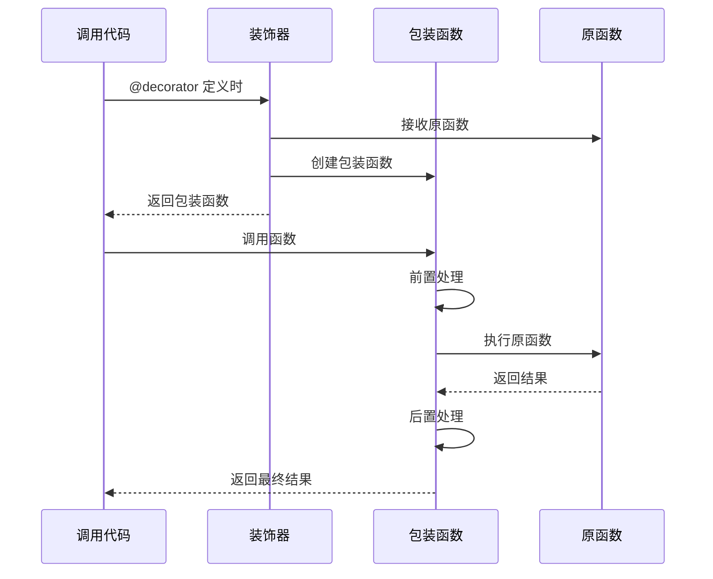
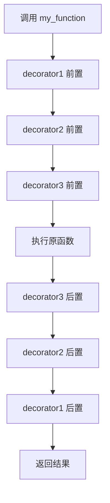

# Python 装饰器完全指南

## 概述

装饰器是 Python 最强大的特性之一,它允许在不修改原函数代码的情况下,动态地扩展或修改函数的行为。装饰器本质上是接受一个函数作为参数并返回一个新函数的高阶函数,广泛应用于日志记录、性能监控、权限检查、缓存等场景。

理解装饰器需要掌握闭包、高阶函数、`*args` 和 `**kwargs` 等概念。本指南将从基础到高级,全面讲解装饰器的原理、用法和最佳实践。

## 核心概念

### 1. 装饰器的基本原理

装饰器利用了 Python 的两个核心特性:
1. **函数是一等公民**: 函数可以作为参数传递、作为返回值、赋值给变量
2. **闭包**: 内部函数可以访问外部函数的变量,即使外部函数已经返回

```python
# 最简单的装饰器
def my_decorator(func):
    def wrapper():
        print("Before function call")
        result = func()
        print("After function call")
        return result
    return wrapper

# 使用装饰器
@my_decorator
def say_hello():
    print("Hello!")

# 等价于
say_hello = my_decorator(say_hello)
```

### 2. 装饰器的执行流程



### 3. 带参数的装饰器

```python
from functools import wraps

def decorator_with_args(arg1, arg2):
    """带参数的装饰器"""
    def actual_decorator(func):
        @wraps(func)
        def wrapper(*args, **kwargs):
            print(f"Decorator args: {arg1}, {arg2}")
            return func(*args, **kwargs)
        return wrapper
    return actual_decorator

@decorator_with_args("hello", "world")
def my_function(x, y):
    return x + y

# 执行
result = my_function(3, 5)
# 输出: Decorator args: hello, world
```

## 实现指南

### 基础装饰器模式

#### 1. 简单装饰器

```python
from functools import wraps
import time

def timer(func):
    """测量函数执行时间的装饰器"""
    @wraps(func)
    def wrapper(*args, **kwargs):
        start_time = time.perf_counter()
        result = func(*args, **kwargs)
        end_time = time.perf_counter()
        print(f"{func.__name__} executed in {end_time - start_time:.4f} seconds")
        return result
    return wrapper

@timer
def slow_function():
    time.sleep(1)
    return "Done"

slow_function()
# 输出: slow_function executed in 1.0012 seconds
```

**关键点**:
- 使用 `@wraps(func)` 保留原函数的元数据(`__name__`, `__doc__` 等)
- 使用 `*args, **kwargs` 支持任意参数
- 始终返回原函数的结果

#### 2. 带参数的装饰器

```python
from functools import wraps

def repeat(times):
    """重复执行函数指定次数"""
    def decorator(func):
        @wraps(func)
        def wrapper(*args, **kwargs):
            results = []
            for i in range(times):
                result = func(*args, **kwargs)
                results.append(result)
            return results
        return wrapper
    return decorator

@repeat(times=3)
def greet(name):
    return f"Hello, {name}!"

print(greet("Alice"))
# 输出: ['Hello, Alice!', 'Hello, Alice!', 'Hello, Alice!']
```

#### 3. 类装饰器

```python
class CountCalls:
    """统计函数调用次数的类装饰器"""
    
    def __init__(self, func):
        self.func = func
        self.count = 0
        self.__name__ = func.__name__
    
    def __call__(self, *args, **kwargs):
        self.count += 1
        print(f"Call {self.count} of {self.func.__name__}")
        return self.func(*args, **kwargs)

@CountCalls
def say_hello():
    print("Hello!")

say_hello()  # Call 1 of say_hello
say_hello()  # Call 2 of say_hello
```

### 高级装饰器模式

#### 1. 装饰器栈(多个装饰器组合)

```python
@decorator1
@decorator2
@decorator3
def my_function():
    pass

# 等价于
my_function = decorator1(decorator2(decorator3(my_function)))
```

**执行顺序**: 从下到上应用,从外到内执行



#### 2. 可选参数装饰器

```python
from functools import wraps

def smart_decorator(_func=None, *, option1="default", option2=True):
    """既可以带参数使用,也可以不带参数使用"""
    def decorator(func):
        @wraps(func)
        def wrapper(*args, **kwargs):
            print(f"Options: option1={option1}, option2={option2}")
            return func(*args, **kwargs)
        return wrapper
    
    # 如果直接调用 @smart_decorator
    if _func is None:
        return decorator
    # 如果带参数调用 @smart_decorator()
    else:
        return decorator(_func)

# 使用方式 1: 不带参数
@smart_decorator
def func1():
    pass

# 使用方式 2: 带参数
@smart_decorator(option1="custom", option2=False)
def func2():
    pass
```

#### 3. 异步装饰器

```python
from functools import wraps
import asyncio

def async_timer(func):
    """异步函数计时装饰器"""
    @wraps(func)
    async def wrapper(*args, **kwargs):
        start = asyncio.get_event_loop().time()
        result = await func(*args, **kwargs)
        end = asyncio.get_event_loop().time()
        print(f"{func.__name__} took {end - start:.4f} seconds")
        return result
    return wrapper

@async_timer
async def async_task():
    await asyncio.sleep(1)
    return "Async done"

# 执行
asyncio.run(async_task())
```

#### 4. 装饰器工厂

```python
from functools import wraps

class DecoratorFactory:
    """动态创建装饰器的工厂"""
    
    @staticmethod
    def create_logger(log_level="INFO"):
        def decorator(func):
            @wraps(func)
            def wrapper(*args, **kwargs):
                print(f"[{log_level}] Calling {func.__name__}")
                result = func(*args, **kwargs)
                print(f"[{log_level}] {func.__name__} returned")
                return result
            return wrapper
        return decorator

# 使用
info_logger = DecoratorFactory.create_logger("INFO")
debug_logger = DecoratorFactory.create_logger("DEBUG")

@info_logger
def important_function():
    return "Important result"
```

## 实战案例

### 案例 1: 缓存装饰器 (Memoization)

```python
from functools import wraps

def memoize(func):
    """缓存函数结果"""
    cache = {}
    
    @wraps(func)
    def wrapper(*args):
        if args not in cache:
            cache[args] = func(*args)
        return cache[args]
    
    wrapper.cache = cache  # 暴露缓存供外部访问
    return wrapper

@memoize
def fibonacci(n):
    """斐波那契数列"""
    if n < 2:
        return n
    return fibonacci(n - 1) + fibonacci(n - 2)

# 测试
print(fibonacci(100))  # 第一次计算
print(fibonacci(100))  # 从缓存读取
print(fibonacci.cache)  # 查看缓存
```

### 案例 2: 重试装饰器

```python
from functools import wraps
import time
from typing import Callable, Type

def retry(
    max_attempts: int = 3,
    delay: float = 1.0,
    exceptions: tuple = (Exception,),
    backoff: float = 2.0
):
    """自动重试装饰器"""
    def decorator(func):
        @wraps(func)
        def wrapper(*args, **kwargs):
            attempts = 0
            current_delay = delay
            
            while attempts < max_attempts:
                try:
                    return func(*args, **kwargs)
                except exceptions as e:
                    attempts += 1
                    if attempts == max_attempts:
                        raise
                    
                    print(f"Attempt {attempts} failed: {e}")
                    print(f"Retrying in {current_delay} seconds...")
                    time.sleep(current_delay)
                    current_delay *= backoff
        
        return wrapper
    return decorator

# 使用
@retry(max_attempts=3, delay=1.0, exceptions=(ConnectionError,))
def fetch_data(url):
    import random
    if random.random() < 0.7:
        raise ConnectionError("Network error")
    return f"Data from {url}"

fetch_data("https://api.example.com")
```

### 案例 3: 权限检查装饰器

```python
from functools import wraps
from typing import List

def require_permissions(*required_permissions: str):
    """权限检查装饰器"""
    def decorator(func):
        @wraps(func)
        def wrapper(user_permissions: List[str], *args, **kwargs):
            # 检查用户是否拥有所有必需权限
            missing = set(required_permissions) - set(user_permissions)
            if missing:
                raise PermissionError(
                    f"Missing required permissions: {missing}"
                )
            return func(*args, **kwargs)
        return wrapper
    return decorator

# 使用
@require_permissions("admin", "write")
def delete_user(user_id):
    return f"User {user_id} deleted"

# 测试
try:
    delete_user(["admin", "write"], user_id=123)  # 成功
    delete_user(["read"], user_id=456)  # 抛出 PermissionError
except PermissionError as e:
    print(e)
```

### 案例 4: 单例模式装饰器

```python
from functools import wraps

def singleton(cls):
    """单例装饰器"""
    instances = {}
    
    @wraps(cls)
    def get_instance(*args, **kwargs):
        if cls not in instances:
            instances[cls] = cls(*args, **kwargs)
        return instances[cls]
    
    return get_instance

@singleton
class Database:
    def __init__(self, connection_string):
        self.connection_string = connection_string
        print(f"Creating database connection: {connection_string}")

# 测试
db1 = Database("mysql://localhost/db")
db2 = Database("mysql://localhost/db")
print(db1 is db2)  # True
```

### 案例 5: 类型检查装饰器

```python
from functools import wraps
from typing import get_type_hints
import inspect

def validate_types(func):
    """运行时类型检查装饰器"""
    @wraps(func)
    def wrapper(*args, **kwargs):
        # 获取类型提示
        hints = get_type_hints(func)
        sig = inspect.signature(func)
        bound_args = sig.bind(*args, **kwargs)
        bound_args.apply_defaults()
        
        # 检查参数类型
        for param_name, value in bound_args.arguments.items():
            if param_name in hints:
                expected_type = hints[param_name]
                if not isinstance(value, expected_type):
                    raise TypeError(
                        f"Parameter '{param_name}' expected {expected_type}, "
                        f"got {type(value)}"
                    )
        
        # 执行函数
        result = func(*args, **kwargs)
        
        # 检查返回值类型
        if 'return' in hints:
            expected_return = hints['return']
            if not isinstance(result, expected_return):
                raise TypeError(
                    f"Return value expected {expected_return}, "
                    f"got {type(result)}"
                )
        
        return result
    
    return wrapper

# 使用
@validate_types
def add_numbers(a: int, b: int) -> int:
    return a + b

add_numbers(3, 5)  # 正常
add_numbers(3, "5")  # TypeError
```

## 最佳实践

### 1. 始终使用 functools.wraps

```python
# ❌ 错误: 丢失元数据
def bad_decorator(func):
    def wrapper(*args, **kwargs):
        return func(*args, **kwargs)
    return wrapper

@bad_decorator
def example():
    """This is an example function"""
    pass

print(example.__name__)  # wrapper (错误!)
print(example.__doc__)   # None (错误!)

# ✅ 正确: 保留元数据
from functools import wraps

def good_decorator(func):
    @wraps(func)
    def wrapper(*args, **kwargs):
        return func(*args, **kwargs)
    return wrapper

@good_decorator
def example():
    """This is an example function"""
    pass

print(example.__name__)  # example (正确!)
print(example.__doc__)   # This is an example function (正确!)
```

### 2. 保持装饰器简洁

```python
# ❌ 错误: 装饰器做太多事情
def bad_decorator(func):
    @wraps(func)
    def wrapper(*args, **kwargs):
        # 日志记录
        # 权限检查
        # 缓存检查
        # 性能监控
        # 重试逻辑
        # ... 太多职责
        return func(*args, **kwargs)
    return wrapper

# ✅ 正确: 单一职责,组合使用
@log_calls
@check_permissions
@cache_result
@monitor_performance
def good_function():
    pass
```

### 3. 正确处理异常

```python
from functools import wraps

def safe_decorator(func):
    @wraps(func)
    def wrapper(*args, **kwargs):
        try:
            return func(*args, **kwargs)
        except Exception as e:
            # 记录异常但不要吞掉它
            print(f"Error in {func.__name__}: {e}")
            raise  # 重新抛出异常
    return wrapper
```

### 4. 文档化装饰器

```python
from functools import wraps

def documented_decorator(func):
    """
    示例装饰器,展示如何文档化装饰器。
    
    Args:
        func: 被装饰的函数
        
    Returns:
        包装后的函数
        
    Example:
        @documented_decorator
        def my_function():
            pass
    """
    @wraps(func)
    def wrapper(*args, **kwargs):
        """包装函数的文档字符串"""
        return func(*args, **kwargs)
    
    # 添加额外的文档
    wrapper._decorator_name = "documented_decorator"
    return wrapper
```

### 5. 线程安全

```python
from functools import wraps
import threading

def thread_safe(func):
    """线程安全装饰器"""
    lock = threading.Lock()
    
    @wraps(func)
    def wrapper(*args, **kwargs):
        with lock:
            return func(*args, **kwargs)
    
    return wrapper

@thread_safe
def increment_counter(counter):
    counter['value'] += 1
    return counter['value']
```

## 常见陷阱

### 1. 忘记返回原函数结果

```python
# ❌ 错误
def bad_decorator(func):
    def wrapper(*args, **kwargs):
        func(*args, **kwargs)  # 没有返回结果!
    return wrapper

# ✅ 正确
def good_decorator(func):
    @wraps(func)
    def wrapper(*args, **kwargs):
        return func(*args, **kwargs)  # 返回结果
    return wrapper
```

### 2. 装饰器参数错误

```python
# ❌ 错误: 忘记调用装饰器工厂
@retry  # 缺少括号
def my_function():
    pass

# ✅ 正确
@retry()  # 带括号
def my_function():
    pass

# 或者使用可选参数模式
def retry(_func=None, *, max_attempts=3):
    def decorator(func):
        @wraps(func)
        def wrapper(*args, **kwargs):
            for _ in range(max_attempts):
                try:
                    return func(*args, **kwargs)
                except Exception:
                    pass
        return wrapper
    
    if _func is None:
        return decorator
    else:
        return decorator(_func)

# 现在两种方式都支持
@retry
def func1():
    pass

@retry(max_attempts=5)
def func2():
    pass
```

### 3. 闭包变量陷阱

```python
# ❌ 错误: 闭包中的循环变量
def create_multipliers():
    return [lambda x: x * i for i in range(5)]

multipliers = create_multipliers()
print(multipliers[0](10))  # 40 (期望 0)
print(multipliers[1](10))  # 40 (期望 10)

# ✅ 正确: 使用默认参数捕获变量
def create_multipliers():
    return [lambda x, i=i: x * i for i in range(5)]

multipliers = create_multipliers()
print(multipliers[0](10))  # 0
print(multipliers[1](10))  # 10
```

### 4. 类方法装饰器顺序

```python
class MyClass:
    # ❌ 错误: @classmethod 必须在最外层
    @decorator
    @classmethod
    def method(cls):
        pass
    
    # ✅ 正确: @classmethod 在内层
    @classmethod
    @decorator
    def method(cls):
        pass
```

## 性能考虑

### 装饰器的性能影响

```python
import timeit
from functools import wraps

# 原函数
def original_function(n):
    return sum(range(n))

# 带装饰器的函数
def simple_decorator(func):
    @wraps(func)
    def wrapper(*args, **kwargs):
        return func(*args, **kwargs)
    return wrapper

@simple_decorator
def decorated_function(n):
    return sum(range(n))

# 性能对比
original_time = timeit.timeit(
    lambda: original_function(1000),
    number=100000
)

decorated_time = timeit.timeit(
    lambda: decorated_function(1000),
    number=100000
)

print(f"Original: {original_time:.4f}s")
print(f"Decorated: {decorated_time:.4f}s")
print(f"Overhead: {(decorated_time - original_time) / original_time * 100:.2f}%")
```

**优化建议**:
1. 避免在装饰器中进行不必要的计算
2. 使用 `functools.lru_cache` 缓存装饰器结果
3. 对于性能关键代码,考虑内联优化而非装饰器

## 参考资料

### 官方文档
- [Python Decorators PEP 318](https://www.python.org/dev/peps/pep-0318/)
- [Python functools Module](https://docs.python.org/3/library/functools.html)
- [Python Descriptor Protocol](https://docs.python.org/3/howto/descriptor.html)

### 经典文章
- [Understanding Python Decorators](https://realpython.com/primer-on-python-decorators/)
- [Python Decorators: A Complete Guide](https://www.datacamp.com/tutorial/decorators-python)
- [Advanced Python Decorators](https://www.toptal.com/python/python-decorators)

### 书籍
- *Fluent Python* by Luciano Ramalho (Chapter 7: Decorators and Closures)
- *Python Cookbook* by David Beazley (Chapter 9: Metaprogramming)
- *Effective Python* by Brett Slatkin (Item 26: Use functools.wraps)

### 视频教程
- [Raymond Hettinger - Python's Class Development Toolkit](https://www.youtube.com/watch?v=HTLu2DFOdTg)
- [James Powell - Decorators: A Powerful and Useful Tool in Python](https://www.youtube.com/watch?v=4QCYT49rHvY)

---

**知识ID**: `python-decorators-complete`  
**领域**: development  
**类型**: standards  
**难度**: intermediate  
**质量分**: 92  
**维护者**: python-team@umadev.com  
**最后更新**: 2026-03-29
