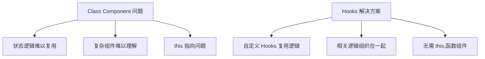

# React Hooks 完全指南 - 从入门到精通

## 概述

React Hooks 是 React 16.8 引入的革命性特性,它允许你在函数组件中使用状态和其他 React 特性,而无需编写类组件。Hooks 的出现彻底改变了 React 应用的编写方式,使代码更简洁、更易复用、更易测试。

本指南将全面讲解 React Hooks 的核心概念、常用 Hooks 的深度用法、自定义 Hooks 的最佳实践,以及 Hooks 在实际项目中的高级应用模式。

## 核心概念

### 1. 为什么需要 Hooks?

在 Hooks 出现之前,React 组件面临三大问题:

1. **状态逻辑难以复用**: 类组件的状态逻辑分散在生命周期方法中,难以提取和复用
2. **复杂组件难以理解**: 相关逻辑分散在不同生命周期方法中,不相关逻辑混在一起
3. **类组件的 this 指向问题**: 需要正确绑定事件处理器,容易出错



### 2. Hooks 的两条黄金法则

#### 法则 1: 只在顶层调用 Hooks

```javascript
// ❌ 错误: 在条件语句中调用 Hook
if (isLoading) {
  const [data, setData] = useState(null);
}

// ❌ 错误: 在循环中调用 Hook
items.forEach(item => {
  const [state, setState] = useState(item);
});

// ❌ 错误: 在嵌套函数中调用 Hook
function handleClick() {
  const [count, setCount] = useState(0);
}

// ✅ 正确: 在组件顶层调用
function MyComponent() {
  const [data, setData] = useState(null);
  const [count, setCount] = useState(0);
  
  if (isLoading) {
    // 使用 data
  }
}
```

#### 法则 2: 只在 React 函数中调用 Hooks

```javascript
// ❌ 错误: 在普通 JavaScript 函数中调用
function formatData(data) {
  const [formatted, setFormatted] = useState(data);
  return formatted;
}

// ✅ 正确: 在 React 组件中调用
function DataFormatter({ data }) {
  const [formatted, setFormatted] = useState(data);
  return <div>{formatted}</div>;
}

// ✅ 正确: 在自定义 Hook 中调用
function useFormattedData(initialData) {
  const [formatted, setFormatted] = useState(initialData);
  // ...
  return formatted;
}
```

### 3. Hooks 的执行顺序

React 依赖 Hooks 的调用顺序来正确保存内部状态。

```mermaid
sequenceDiagram
    participant Render1 as 第一次渲染
    participant Render2 as 第二次渲染
    participant Hook1 as useState #1
    participant Hook2 as useEffect #2
    participant Hook3 as useState #3
    
    Render1->>Hook1: 调用顺序 1
    Render1->>Hook2: 调用顺序 2
    Render1->>Hook3: 调用顺序 3
    
    Note over Hook1,Hook2,Hook3: React 记住顺序
    
    Render2->>Hook1: 调用顺序 1 (相同)
    Render2->>Hook2: 调用顺序 2 (相同)
    Render2->>Hook3: 调用顺序 3 (相同)
```

## 核心 Hooks 深度讲解

### 1. useState - 状态管理

#### 基础用法

```javascript
import { useState } from 'react';

function Counter() {
  // 声明状态变量 count,初始值为 0
  const [count, setCount] = useState(0);
  
  return (
    <div>
      <p>Count: {count}</p>
      <button onClick={() => setCount(count + 1)}>
        Increment
      </button>
    </div>
  );
}
```

#### 函数式更新

```javascript
function Counter() {
  const [count, setCount] = useState(0);
  
  // ❌ 错误: 依赖当前状态
  const incrementBad = () => {
    setCount(count + 1);
    setCount(count + 1); // 仍然是基于旧的 count
  };
  
  // ✅ 正确: 使用函数式更新
  const incrementGood = () => {
    setCount(prev => prev + 1);
    setCount(prev => prev + 1); // 正确: prev 是最新状态
  };
  
  return (
    <button onClick={incrementGood}>Count: {count}</button>
  );
}
```

#### 惰性初始化

```javascript
function ExpensiveComponent() {
  // ❌ 错误: 每次渲染都会执行 expensiveComputation
  const [state, setState] = useState(expensiveComputation());
  
  // ✅ 正确: 只在首次渲染时执行
  const [state, setState] = useState(() => {
    console.log('Lazy initialization');
    return expensiveComputation();
  });
  
  return <div>{state}</div>;
}

function expensiveComputation() {
  // 假设这是一个昂贵的计算
  let result = 0;
  for (let i = 0; i < 1000000; i++) {
    result += i;
  }
  return result;
}
```

#### 对象和数组状态

```javascript
function UserProfile() {
  const [user, setUser] = useState({
    name: 'Alice',
    age: 25,
    email: 'alice@example.com'
  });
  
  // ❌ 错误: 直接修改状态
  const updateNameBad = (newName) => {
    user.name = newName;
    setUser(user);
  };
  
  // ✅ 正确: 创建新对象
  const updateNameGood = (newName) => {
    setUser(prev => ({
      ...prev,
      name: newName
    }));
  };
  
  return (
    <input
      value={user.name}
      onChange={(e) => updateNameGood(e.target.value)}
    />
  );
}
```

### 2. useEffect - 副作用处理

#### 基础用法

```javascript
import { useState, useEffect } from 'react';

function UserProfile({ userId }) {
  const [user, setUser] = useState(null);
  
  useEffect(() => {
    // 副作用: 数据获取
    fetchUser(userId).then(data => setUser(data));
    
    // 清理函数 (可选)
    return () => {
      console.log('Cleanup before next effect or unmount');
    };
  }, [userId]); // 依赖数组
  
  return user ? <div>{user.name}</div> : <div>Loading...</div>;
}
```

#### 依赖数组详解

```javascript
function Example({ userId, categoryId }) {
  useEffect(() => {
    console.log('Effect executed');
    // 副作用代码
  }, [userId, categoryId]); // 当 userId 或 categoryId 变化时执行
  
  useEffect(() => {
    console.log('Effect executed once');
    // 空依赖数组: 只在挂载时执行一次
  }, []);
  
  useEffect(() => {
    console.log('Effect executed every render');
    // 无依赖数组: 每次渲染后都执行
  });
}
```

#### 清理副作用

```javascript
function ChatRoom({ roomId }) {
  const [messages, setMessages] = useState([]);
  
  useEffect(() => {
    const connection = createConnection(roomId);
    
    // 订阅新消息
    connection.on('message', (message) => {
      setMessages(prev => [...prev, message]);
    });
    
    // 清理函数: 断开连接
    return () => {
      connection.disconnect();
    };
  }, [roomId]);
  
  return (
    <ul>
      {messages.map(msg => <li key={msg.id}>{msg.text}</li>)}
    </ul>
  );
}
```

#### useEffect 的常见模式

```javascript
function DataFetcher({ url }) {
  const [data, setData] = useState(null);
  const [loading, setLoading] = useState(true);
  const [error, setError] = useState(null);
  
  useEffect(() => {
    let cancelled = false;
    
    async function fetchData() {
      try {
        setLoading(true);
        setError(null);
        
        const response = await fetch(url);
        const result = await response.json();
        
        if (!cancelled) {
          setData(result);
        }
      } catch (err) {
        if (!cancelled) {
          setError(err.message);
        }
      } finally {
        if (!cancelled) {
          setLoading(false);
        }
      }
    }
    
    fetchData();
    
    return () => {
      cancelled = true;
    };
  }, [url]);
  
  if (loading) return <div>Loading...</div>;
  if (error) return <div>Error: {error}</div>;
  return <div>{JSON.stringify(data)}</div>;
}
```

### 3. useContext - 上下文消费

#### 基础用法

```javascript
import { createContext, useContext } from 'react';

// 创建 Context
const ThemeContext = createContext('light');

function App() {
  return (
    <ThemeContext.Provider value="dark">
      <Toolbar />
    </ThemeContext.Provider>
  );
}

function Toolbar() {
  return <ThemedButton />;
}

function ThemedButton() {
  // 使用 useContext 消费 Context
  const theme = useContext(ThemeContext);
  return <button className={theme}>Themed Button</button>;
}
```

#### Context + useState 模式

```javascript
import { createContext, useContext, useState } from 'react';

// 创建 Context
const UserContext = createContext(null);

function App() {
  const [user, setUser] = useState(null);
  
  return (
    <UserContext.Provider value={{ user, setUser }}>
      <UserProfile />
      <LoginButton />
    </UserContext.Provider>
  );
}

function UserProfile() {
  const { user } = useContext(UserContext);
  
  return user ? (
    <div>Hello, {user.name}</div>
  ) : (
    <div>Please log in</div>
  );
}

function LoginButton() {
  const { user, setUser } = useContext(UserContext);
  
  const handleLogin = () => {
    setUser({ name: 'Alice', email: 'alice@example.com' });
  };
  
  const handleLogout = () => {
    setUser(null);
  };
  
  return user ? (
    <button onClick={handleLogout}>Logout</button>
  ) : (
    <button onClick={handleLogin}>Login</button>
  );
}
```

### 4. useReducer - 复杂状态管理

#### 基础用法

```javascript
import { useReducer } from 'react';

// Reducer 函数
function todoReducer(state, action) {
  switch (action.type) {
    case 'add':
      return [...state, {
        id: Date.now(),
        text: action.text,
        completed: false
      }];
    case 'toggle':
      return state.map(todo =>
        todo.id === action.id
          ? { ...todo, completed: !todo.completed }
          : todo
      );
    case 'delete':
      return state.filter(todo => todo.id !== action.id);
    default:
      throw new Error(`Unknown action: ${action.type}`);
  }
}

function TodoList() {
  const [todos, dispatch] = useReducer(todoReducer, []);
  
  const addTodo = (text) => {
    dispatch({ type: 'add', text });
  };
  
  const toggleTodo = (id) => {
    dispatch({ type: 'toggle', id });
  };
  
  const deleteTodo = (id) => {
    dispatch({ type: 'delete', id });
  };
  
  return (
    <div>
      <button onClick={() => addTodo('New Todo')}>Add</button>
      <ul>
        {todos.map(todo => (
          <li key={todo.id}>
            <span
              onClick={() => toggleTodo(todo.id)}
              style={{ textDecoration: todo.completed ? 'line-through' : 'none' }}
            >
              {todo.text}
            </span>
            <button onClick={() => deleteTodo(todo.id)}>Delete</button>
          </li>
        ))}
      </ul>
    </div>
  );
}
```

#### 惰性初始化

```javascript
function TodoList({ initialTodos }) {
  // 惰性初始化
  const [todos, dispatch] = useReducer(
    todoReducer,
    initialTodos,
    (initial) => {
      // 可以在这里执行昂贵的初始化逻辑
      return initial.filter(todo => !todo.deleted);
    }
  );
  
  // ...
}
```

### 5. useMemo - 性能优化

#### 基础用法

```javascript
import { useMemo } from 'react';

function ExpensiveComponent({ items, filter }) {
  // ❌ 错误: 每次渲染都执行昂贵计算
  const filteredItems = items.filter(filter).map(expensiveTransformation);
  
  // ✅ 正确: 使用 useMemo 缓存结果
  const filteredItems = useMemo(() => {
    console.log('Recalculating...');
    return items.filter(filter).map(expensiveTransformation);
  }, [items, filter]);
  
  return (
    <ul>
      {filteredItems.map(item => <li key={item.id}>{item.name}</li>)}
    </ul>
  );
}

function expensiveTransformation(item) {
  // 假设这是一个昂贵的转换
  let result = item;
  for (let i = 0; i < 1000; i++) {
    result = { ...result, score: (result.score || 0) + i };
  }
  return result;
}
```

#### 引用相等性优化

```javascript
function ParentComponent() {
  const [count, setCount] = useState(0);
  const items = [{ id: 1, name: 'Item 1' }, { id: 2, name: 'Item 2' }];
  
  // ❌ 错误: 每次渲染都创建新数组
  // const sortedItems = items.sort((a, b) => a.name.localeCompare(b.name));
  
  // ✅ 正确: 使用 useMemo 保持引用相等
  const sortedItems = useMemo(
    () => items.sort((a, b) => a.name.localeCompare(b.name)),
    [items]
  );
  
  return (
    <div>
      <button onClick={() => setCount(count + 1)}>Count: {count}</button>
      <ChildComponent items={sortedItems} />
    </div>
  );
}

// 使用 React.memo 优化子组件
const ChildComponent = React.memo(({ items }) => {
  console.log('ChildComponent rendered');
  return <div>{items.length} items</div>;
});
```

### 6. useCallback - 函数缓存

#### 基础用法

```javascript
import { useState, useCallback } from 'react';

function ParentComponent() {
  const [count, setCount] = useState(0);
  const [items, setItems] = useState([]);
  
  // ❌ 错误: 每次渲染都创建新函数
  // const handleClick = () => {
  //   console.log('Clicked');
  // };
  
  // ✅ 正确: 使用 useCallback 缓存函数
  const handleClick = useCallback(() => {
    console.log('Clicked');
  }, []);
  
  const addItem = useCallback((item) => {
    setItems(prev => [...prev, item]);
  }, []);
  
  return (
    <div>
      <button onClick={() => setCount(count + 1)}>Count: {count}</button>
      <ChildComponent onClick={handleClick} onAdd={addItem} />
    </div>
  );
}

// 使用 React.memo 优化
const ChildComponent = React.memo(({ onClick, onAdd }) => {
  console.log('ChildComponent rendered');
  return (
    <div>
      <button onClick={onClick}>Click me</button>
      <button onClick={() => onAdd({ id: Date.now() })}>Add item</button>
    </div>
  );
});
```

## 自定义 Hooks

### 1. useLocalStorage - 持久化状态

```javascript
import { useState, useEffect } from 'react';

function useLocalStorage(key, initialValue) {
  // 惰性初始化
  const [storedValue, setStoredValue] = useState(() => {
    try {
      const item = window.localStorage.getItem(key);
      return item ? JSON.parse(item) : initialValue;
    } catch (error) {
      console.error(error);
      return initialValue;
    }
  });
  
  // 返回包装函数
  const setValue = useCallback((value) => {
    try {
      const valueToStore = value instanceof Function ? value(storedValue) : value;
      setStoredValue(valueToStore);
      window.localStorage.setItem(key, JSON.stringify(valueToStore));
    } catch (error) {
      console.error(error);
    }
  }, [key, storedValue]);
  
  return [storedValue, setValue];
}

// 使用示例
function App() {
  const [name, setName] = useLocalStorage('name', 'Alice');
  
  return (
    <input
      value={name}
      onChange={(e) => setName(e.target.value)}
      placeholder="Enter your name"
    />
  );
}
```

### 2. useFetch - 数据获取

```javascript
import { useState, useEffect } from 'react';

function useFetch(url) {
  const [data, setData] = useState(null);
  const [loading, setLoading] = useState(true);
  const [error, setError] = useState(null);
  
  useEffect(() => {
    let cancelled = false;
    
    async function fetchData() {
      try {
        setLoading(true);
        setError(null);
        
        const response = await fetch(url);
        if (!response.ok) {
          throw new Error(`HTTP error! status: ${response.status}`);
        }
        
        const result = await response.json();
        
        if (!cancelled) {
          setData(result);
        }
      } catch (err) {
        if (!cancelled) {
          setError(err.message);
        }
      } finally {
        if (!cancelled) {
          setLoading(false);
        }
      }
    }
    
    fetchData();
    
    return () => {
      cancelled = true;
    };
  }, [url]);
  
  return { data, loading, error };
}

// 使用示例
function UserProfile({ userId }) {
  const { data: user, loading, error } = useFetch(
    `https://api.example.com/users/${userId}`
  );
  
  if (loading) return <div>Loading...</div>;
  if (error) return <div>Error: {error}</div>;
  
  return (
    <div>
      <h1>{user.name}</h1>
      <p>{user.email}</p>
    </div>
  );
}
```

### 3. useDebounce - 防抖

```javascript
import { useState, useEffect } from 'react';

function useDebounce(value, delay) {
  const [debouncedValue, setDebouncedValue] = useState(value);
  
  useEffect(() => {
    const handler = setTimeout(() => {
      setDebouncedValue(value);
    }, delay);
    
    return () => {
      clearTimeout(handler);
    };
  }, [value, delay]);
  
  return debouncedValue;
}

// 使用示例
function SearchInput() {
  const [searchTerm, setSearchTerm] = useState('');
  const debouncedSearchTerm = useDebounce(searchTerm, 500);
  
  useEffect(() => {
    if (debouncedSearchTerm) {
      // 执行搜索
      console.log('Searching for:', debouncedSearchTerm);
    }
  }, [debouncedSearchTerm]);
  
  return (
    <input
      value={searchTerm}
      onChange={(e) => setSearchTerm(e.target.value)}
      placeholder="Search..."
    />
  );
}
```

### 4. useWindowSize - 响应式设计

```javascript
import { useState, useEffect } from 'react';

function useWindowSize() {
  const [windowSize, setWindowSize] = useState({
    width: typeof window !== 'undefined' ? window.innerWidth : 0,
    height: typeof window !== 'undefined' ? window.innerHeight : 0
  });
  
  useEffect(() => {
    function handleResize() {
      setWindowSize({
        width: window.innerWidth,
        height: window.innerHeight
      });
    }
    
    window.addEventListener('resize', handleResize);
    
    // 立即调用一次
    handleResize();
    
    return () => {
      window.removeEventListener('resize', handleResize);
    };
  }, []);
  
  return windowSize;
}

// 使用示例
function ResponsiveComponent() {
  const { width, height } = useWindowSize();
  
  return (
    <div>
      <p>Width: {width}px</p>
      <p>Height: {height}px</p>
      {width < 768 ? <MobileLayout /> : <DesktopLayout />}
    </div>
  );
}
```

### 5. usePrevious - 获取前一个值

```javascript
import { useRef, useEffect } from 'react';

function usePrevious(value) {
  const ref = useRef();
  
  useEffect(() => {
    ref.current = value;
  }, [value]);
  
  return ref.current;
}

// 使用示例
function Counter() {
  const [count, setCount] = useState(0);
  const prevCount = usePrevious(count);
  
  return (
    <div>
      <p>Current: {count}</p>
      <p>Previous: {prevCount}</p>
      <button onClick={() => setCount(count + 1)}>Increment</button>
    </div>
  );
}
```

## 最佳实践

### 1. 正确设置依赖项

```javascript
function Example({ userId }) {
  const [data, setData] = useState(null);
  
  // ❌ 错误: 缺少依赖
  useEffect(() => {
    fetchUser(userId).then(setData);
  }, []); // userId 应该在依赖中
  
  // ✅ 正确: 包含所有依赖
  useEffect(() => {
    fetchUser(userId).then(setData);
  }, [userId]);
  
  // 或者使用 eslint 插件
  // npm install eslint-plugin-react-hooks --save-dev
}
```

### 2. 避免过度优化

```javascript
function Example({ items }) {
  // ❌ 错误: 过度优化,简单计算不需要 useMemo
  const count = useMemo(() => items.length, [items]);
  
  // ✅ 正确: 简单计算直接执行
  const count = items.length;
  
  // ✅ 正确: 复杂计算使用 useMemo
  const sortedItems = useMemo(
    () => items.filter(item => item.active).sort((a, b) => a.name.localeCompare(b.name)),
    [items]
  );
  
  return <div>{count}</div>;
}
```

### 3. 合理拆分 Effects

```javascript
function Example({ userId, productId }) {
  // ❌ 错误: 不相关的逻辑混在一起
  useEffect(() => {
    fetchUser(userId);
    fetchProduct(productId);
    trackPageView();
  }, [userId, productId]);
  
  // ✅ 正确: 拆分为多个 Effects
  useEffect(() => {
    fetchUser(userId);
  }, [userId]);
  
  useEffect(() => {
    fetchProduct(productId);
  }, [productId]);
  
  useEffect(() => {
    trackPageView();
  }, []); // 只在挂载时执行一次
}
```

### 4. 使用自定义 Hooks 提取逻辑

```javascript
function UserProfile({ userId }) {
  // ❌ 错误: 逻辑分散在组件中
  const [user, setUser] = useState(null);
  const [loading, setLoading] = useState(true);
  const [error, setError] = useState(null);
  
  useEffect(() => {
    // ... fetch logic
  }, [userId]);
  
  // ✅ 正确: 使用自定义 Hook
  const { user, loading, error } = useUser(userId);
  
  if (loading) return <div>Loading...</div>;
  if (error) return <div>Error: {error}</div>;
  
  return <div>{user.name}</div>;
}

// 自定义 Hook
function useUser(userId) {
  const [user, setUser] = useState(null);
  const [loading, setLoading] = useState(true);
  const [error, setError] = useState(null);
  
  useEffect(() => {
    let cancelled = false;
    
    async function fetchUser() {
      try {
        setLoading(true);
        setError(null);
        
        const response = await fetch(`/api/users/${userId}`);
        const data = await response.json();
        
        if (!cancelled) {
          setUser(data);
        }
      } catch (err) {
        if (!cancelled) {
          setError(err.message);
        }
      } finally {
        if (!cancelled) {
          setLoading(false);
        }
      }
    }
    
    fetchUser();
    
    return () => {
      cancelled = true;
    };
  }, [userId]);
  
  return { user, loading, error };
}
```

## 常见陷阱

### 1. 闭包陷阱

```javascript
function Counter() {
  const [count, setCount] = useState(0);
  
  useEffect(() => {
    const id = setInterval(() => {
      // ❌ 错误: count 永远是初始值 0
      console.log(count);
    }, 1000);
    
    return () => clearInterval(id);
  }, []); // 空依赖
  
  useEffect(() => {
    const id = setInterval(() => {
      // ✅ 正确: 使用函数式更新
      setCount(prev => {
        console.log(prev);
        return prev + 1;
      });
    }, 1000);
    
    return () => clearInterval(id);
  }, []);
  
  return <div>{count}</div>;
}
```

### 2. 竞态条件

```javascript
function SearchResults({ query }) {
  const [results, setResults] = useState([]);
  
  useEffect(() => {
    // ❌ 错误: 可能出现竞态条件
    fetch(`/api/search?q=${query}`)
      .then(res => res.json())
      .then(setResults);
  }, [query]);
  
  useEffect(() => {
    // ✅ 正确: 使用清理函数
    let cancelled = false;
    
    fetch(`/api/search?q=${query}`)
      .then(res => res.json())
      .then(data => {
        if (!cancelled) {
          setResults(data);
        }
      });
    
    return () => {
      cancelled = true;
    };
  }, [query]);
  
  return <div>{results.length} results</div>;
}
```

### 3. 无限循环

```javascript
function Example() {
  const [count, setCount] = useState(0);
  
  // ❌ 错误: 无限循环
  useEffect(() => {
    setCount(count + 1);
  }, [count]);
  
  // ✅ 正确: 使用函数式更新
  useEffect(() => {
    setCount(prev => prev + 1);
  }, []); // 空依赖,只在挂载时执行一次
  
  return <div>{count}</div>;
}
```

## 参考资料

### 官方文档
- [React Hooks 官方文档](https://react.dev/reference/react)
- [React Hooks FAQ](https://react.dev/reference/react/hooks)
- [Rules of Hooks](https://react.dev/warnings/invalid-hook-call-warning.html)

### 教程和文章
- [Making Sense of React Hooks](https://medium.com/@dan_abramov/making-setstate-declarative-with-react-hooks-4d13c2cc5d3d)
- [A Complete Guide to useEffect](https://overreacted.io/a-complete-guide-to-useeffect/)
- [React Hooks: Not Magic, Just Arrays](https://medium.com/@ryardley/react-hooks-not-magic-just-arrays-cd4f1fa16c1b)

### 工具
- [eslint-plugin-react-hooks](https://www.npmjs.com/package/eslint-plugin-react-hooks)
- [React Developer Tools](https://react.dev/learn/react-developer-tools)

---

**知识ID**: `react-hooks-complete-guide`  
**领域**: frontend  
**类型**: standards  
**难度**: intermediate  
**质量分**: 93  
**维护者**: frontend-team@umadev.com  
**最后更新**: 2026-03-29
